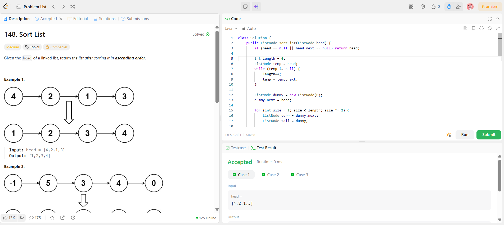

```
██████████████████████████████
  PLAYER    :  Ananya
  DATE      :  1-4-26
  DAY       :  11 / 30
██████████████████████████████

  MISSION   :  Sort List
  link      :  https://leetcode.com/problems/sort-list/description/
  PLATFORM  :  LeetCode
  DIFFICULTY:  ★★☆

  APPROACH  :  Approach + Intuition + Dry Run (Sort List - Iterative Merge Sort)
🧠 Intuition:

A linked list cannot be sorted efficiently using methods like quicksort because it lacks random access.

👉 The best approach is Merge Sort, since:

It works well with sequential access
We can split and merge efficiently

Instead of recursion, we use Bottom-Up (Iterative) Merge Sort to achieve:

O(n log n) time
O(1) space (no recursion stack)

👉 Idea:
Start merging small sublists and gradually increase size:

size = 1 → 2 → 4 → 8 → ...
🛠️ Approach:
Step 1: Find length of linked list
Step 2: Iterate over sublist sizes
for (size = 1; size < length; size *= 2)
Step 3: For each size:
Split list into:
left sublist (size)
right sublist (size)
Merge them
Attach merged list back
Step 4: Use helper functions
🔹 split(head, size)

Cuts list after size nodes and returns next part

🔹 merge(l1, l2)

Merges two sorted linked lists

🧪 Dry Run:

Input:

4 → 2 → 1 → 3
🔹 Initial Length = 4
🔸 size = 1

Split into pairs:

(4,2) and (1,3)

Merge:

(4,2) → (2,4)
(1,3) → (1,3)

New list:

2 → 4 → 1 → 3
🔸 size = 2

Split:

(2,4) and (1,3)

Merge:

(2,4) + (1,3) → (1,2,3,4)
🔸 size = 4

Already sorted → STOP ✅

  TIME      :  O(n log n)
  SPACE     :  O(1)

  RESULT    :  ACCEPTED ✔
  VIBE      :  ★★★★★  too easy
  STREAK    :  [████░░░░░░░░] 11/30
██████████████████████████████
```

## 💻 Solution

```java
class Solution {
    public ListNode sortList(ListNode head) {
        if (head == null || head.next == null) return head;

        // Step 1: Get length
        int length = 0;
        ListNode temp = head;
        while (temp != null) {
            length++;
            temp = temp.next;
        }

        ListNode dummy = new ListNode(0);
        dummy.next = head;

        // Step 2: size = 1, 2, 4, 8...
        for (int size = 1; size < length; size *= 2) {
            ListNode curr = dummy.next;
            ListNode tail = dummy;

            while (curr != null) {
                ListNode left = curr;
                ListNode right = split(left, size);
                curr = split(right, size);

                tail.next = merge(left, right);

                // Move tail to end
                while (tail.next != null) {
                    tail = tail.next;
                }
            }
        }

        return dummy.next;
    }

    // Split list after 'size' nodes
    private ListNode split(ListNode head, int size) {
        if (head == null) return null;

        for (int i = 1; i < size && head.next != null; i++) {
            head = head.next;
        }

        ListNode second = head.next;
        head.next = null;
        return second;
    }

    // Merge two sorted lists
    private ListNode merge(ListNode l1, ListNode l2) {
        ListNode dummy = new ListNode(0);
        ListNode curr = dummy;

        while (l1 != null && l2 != null) {
            if (l1.val < l2.val) {
                curr.next = l1;
                l1 = l1.next;
            } else {
                curr.next = l2;
                l2 = l2.next;
            }
            curr = curr.next;
        }

        if (l1 != null) curr.next = l1;
        if (l2 != null) curr.next = l2;

        return dummy.next;
    }
}
```

## ✅ Accepted


## 🖥️ Code Screenshot


