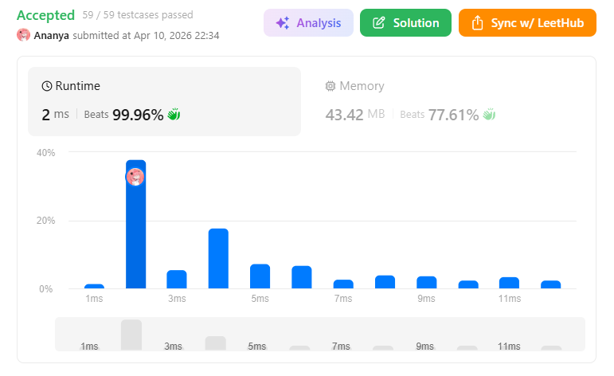
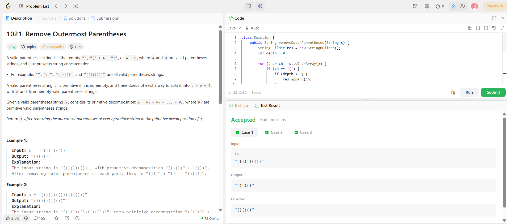

```
██████████████████████████████
  PLAYER    :  Ananya
  DATE      :  10-4-26
  DAY       :  20 / 30
██████████████████████████████

  MISSION   :  Remove Outermost Parentheses
  link      :  https://leetcode.com/problems/remove-outermost-parentheses/
  PLATFORM  :  LeetCode
  DIFFICULTY:  ★☆☆

  APPROACH  :  Intuition

A valid parentheses string is made of primitive blocks.

👉 Example:
"(()())(())" → "(()())" + "(())"

Each primitive:

starts when balance goes from 0 → 1
ends when balance comes back to 0

💡 The outermost parentheses of each primitive are:

the first (
the last )

So our job:
👉 Remove those outer layers from every primitive

🚀 Approach

We track a variable called depth (or balance)

Rules:
1. When we see '(':
If depth > 0 → it's NOT outer → include it
Then increase depth
2. When we see ')':
First decrease depth
If depth > 0 → it's NOT outer → include it
🔥 Why this works:
Outer ( happens when depth == 0 → skip
Outer ) happens when after decrement depth == 0 → skip

Everything else is inside → keep ✅

🔍 Dry Run
Input:

s = "(()())(())"

Step-by-step:
Char	Depth Before	Action	Depth After	Result
(	0	skip	1	
(	1	add	2	(
)	2	add	1	()
(	1	add	2	()(
)	2	add	1	()()
)	1	skip	0	()()
(	0	skip	1	
(	1	add	2	()()(
)	2	add	1	()()()
)	1	skip	0	()()()
✅ Final Answer:

"()()()"

  TIME      :  O(n)
  SPACE     :  O(n)

  RESULT    :  ACCEPTED ✔
  VIBE      :  ★★★★★  too easy
  STREAK    :  [████████░░░░] 20/30
██████████████████████████████
```

## 💻 Solution

```java
class Solution {
    public String removeOuterParentheses(String s) {
        StringBuilder res = new StringBuilder();
        int depth = 0;

        for (char ch : s.toCharArray()) {
            if (ch == '(') {
                if (depth > 0) {
                    res.append(ch);
                }
                depth++;
            } else { // ')'
                depth--;
                if (depth > 0) {
                    res.append(ch);
                }
            }
        }

        return res.toString();
    }
}
```

## ✅ Accepted



## 🖥️ Code Screenshot


