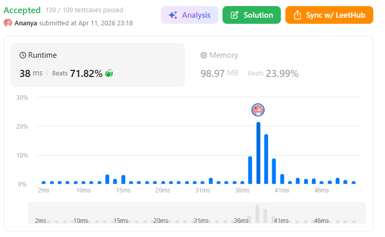
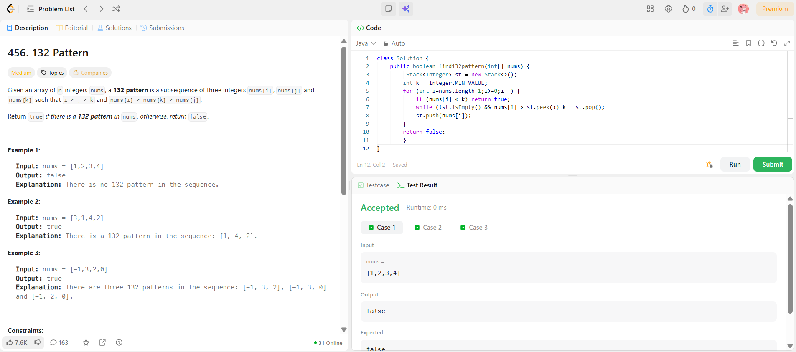

```
██████████████████████████████
  PLAYER    :  Ananya
  DATE      :  11-4-26
  DAY       :  21 / 30
██████████████████████████████

  MISSION   :  132 Pattern
  link      :  https://leetcode.com/problems/132-pattern/
  PLATFORM  :  LeetCode
  DIFFICULTY:  ★★☆

  APPROACH  :  1. The Intuition
A 132 pattern consists of three numbers $nums[i], nums[j], nums[k]$ such that:
Index: 
i < j < k
Value: 
nums[i] < nums[k] < nums[j]
Think of it as: 
Small (1) < Medium (2) < Large (3)
The strategy here is to find the best possible "Medium" (2) and "Large" (3) first, then look for any "Small" (1) that fits. 
By traversing backwards, we treat the current element as a potential "Large" (3) and the elements we've already seen as potential "Mediums" (2).

2. Approach Breakdown
The variable k: This represents the "2" in the 132 pattern. We want this value to be as large as possible so that it's easier to find a "1" ($nums[i]$) that is smaller than it.The Stack: This stores potential "3" candidates. It is a decreasing stack (from bottom to top).
The Logic:Check for "1": If nums[i] < k, we found our pattern! Why? Because for k to have a value (other than -\infty), it must have been popped out of the stack by a larger number. 
That larger number is our "3", and since we are moving right-to-left, that "3" is to the right of our current "1".
Find "2": If nums[i] is greater than the top of the stack, then nums[i] is a potential "3". 
We pop all elements smaller than it from the stack. 
The last popped element becomes our new k (our "2").
Push to Stack: 
We push the current nums[i] onto the stack as a potential "3" for future elements.

3. Dry Run
Input: nums = [3, 1, 4, 2]
StepIndex inums[i]
Is nums[i] < k?
Action
k valueStack (Bottom → Top)
132 2 < -\infty (No)
Push 2-\infty [2]224
4 < -\infty$ (No)
4 > 2, so k = 2. Pop 2, Push 4.
2[4]311 1 < 2 (Yes!)
Return True2[4]

Result: True. 
The pattern is 1 (at index 1), 4 (at index 2), and 2 (at index 3).
  TIME      :  O(n)
  SPACE     :  O(n)

  RESULT    :  ACCEPTED ✔
  VIBE      :  ★★★★★  too easy
  STREAK    :  [████████░░░░] 20/30
██████████████████████████████
```

## 💻 Solution

```java
class Solution {
    public boolean find132pattern(int[] nums) {
         Stack<Integer> st = new Stack<>();
        int k = Integer.MIN_VALUE;
        for (int i=nums.length-1;i>=0;i--) {
            if (nums[i] < k) return true;
            while (!st.isEmpty() && nums[i] > st.peek()) k = st.pop();
            st.push(nums[i]);
        }
        return false;
        }
}
```

## ✅ Accepted



## 🖥️ Code Screenshot


