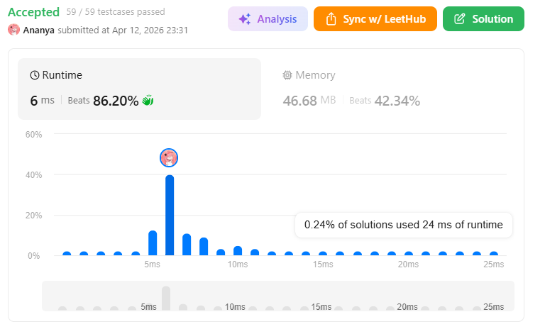
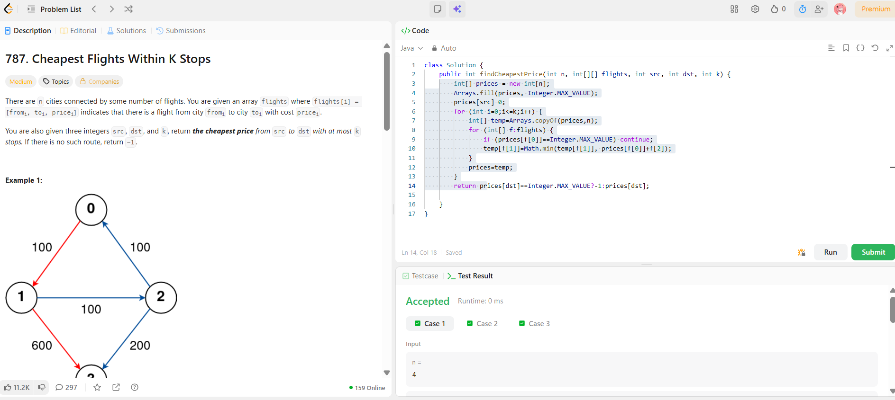

```
██████████████████████████████
  PLAYER    :  Ananya
  DATE      :  12-4-26
  DAY       :  22 / 30
██████████████████████████████

  MISSION   :  Cheapest Flights Within K Stops
  link      :  https://leetcode.com/problems/cheapest-flights-within-k-stops/description/
  PLATFORM  :  LeetCode
  DIFFICULTY:  ★★☆

  APPROACH  :  Intuition (seedha logic)

Think like this:

👉 “At most K stops” means
➡️ Maximum edges allowed = K + 1

Now Bellman-Ford says:

If you relax edges K+1 times, you’ll get shortest path with at most K stops

💡 Core Idea
Each iteration = allow one more edge
We update distances step by step
But ⚠️ we use a temp array so same iteration changes don’t affect others
⚙️ Approach (step-by-step)
Initialize:
prices[src] = 0
Rest = ∞
Loop k+1 times:
Copy array → temp

Relax all flights:

temp[v] = min(temp[v], prices[u] + cost)
Update prices = temp
Return result
❗ Why temp array? (VERY IMPORTANT)

If you update directly:

You might use updated values in same iteration
That allows more than K stops ❌

👉 temp ensures:

each iteration only uses results from previous step

🔥 Dry Run (Example 2)
n = 3
flights = [[0,1,100],[1,2,100],[0,2,500]]
src = 0, dst = 2, k = 1
Initial:
prices = [0, ∞, ∞]
🌀 Iteration 1 (0 stops → 1 edge allowed)

Relax all flights:

0 → 1 (100)
0 → 2 (500)
prices = [0, 100, 500]
🌀 Iteration 2 (1 stop → 2 edges allowed)

Now we can go via intermediate:

1 → 2 → 100 + 100 = 200 ✅ better than 500
prices = [0, 100, 200]
✅ Answer:
200

  TIME      :  O(K*E)
  SPACE     :   O(V)

  RESULT    :  ACCEPTED ✔
  VIBE      :  ★★★★★  too easy
  STREAK    :  [█████████░░░] 22/30
██████████████████████████████
```

## 💻 Solution

```java
class Solution {
    public int findCheapestPrice(int n, int[][] flights, int src, int dst, int k) {
        int[] prices = new int[n];
        Arrays.fill(prices, Integer.MAX_VALUE);
        prices[src]=0;
        for (int i=0;i<=k;i++) {
            int[] temp=Arrays.copyOf(prices,n);
            for (int[] f:flights) {
                if (prices[f[0]]==Integer.MAX_VALUE) continue;
                temp[f[1]]=Math.min(temp[f[1]], prices[f[0]]+f[2]);
            }
            prices=temp;
        }
        return prices[dst]==Integer.MAX_VALUE?-1:prices[dst];
 
    }
}

```

## ✅ Accepted



## 🖥️ Code Screenshot


