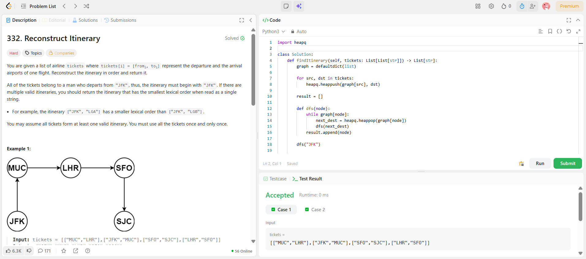

```
██████████████████████████████
  PLAYER    :  Ananya
  DATE      :  13-4-26
  DAY       :  23 / 30
██████████████████████████████

  MISSION   :  Reconstruct Itinerary
  link      :  https://leetcode.com/problems/reconstruct-itinerary/
  PLATFORM  :  LeetCode
  DIFFICULTY:  ★★★

  APPROACH  :  Intuition (what’s REALLY going on)

This isn’t just “find a path” — it’s:

👉 Use ALL tickets exactly once
👉 Start from "JFK"
👉 Pick smallest lexical order when choices exist

That combo = Eulerian Path in a directed graph

💡 Key realization

Every ticket = edge

So problem becomes:

“Find a path that uses every edge exactly once”

That’s literally Eulerian Path.

⚠️ Why greedy fails

If you always pick smallest next airport without backtracking → you can get stuck later.

So instead:
👉 We go deep (DFS)
👉 Fix mistakes while backtracking

⚙️ Approach (Hierholzer’s Algorithm)
Step-by-step:
1. Build graph
Use adjacency list
Store destinations in min-heap (to maintain lexical order)
graph[src] → min heap of destinations
2. DFS traversal
While there are outgoing edges:
pick smallest destination
go deeper
3. Add node AFTER exploring all edges

👉 This is the trick

result.append(node)

This is postorder

4. Reverse result at end
🔥 Dry Run (important — understand flow)
Input:
tickets = [
["JFK","SFO"],
["JFK","ATL"],
["SFO","ATL"],
["ATL","JFK"],
["ATL","SFO"]
]
Step 1: Graph
JFK → [ATL, SFO]
ATL → [JFK, SFO]
SFO → [ATL]

(min-heaps → always smallest first)

Step 2: DFS execution

Let’s walk:

Start: JFK
🔹 Move 1
JFK → ATL
🔹 Move 2
ATL → JFK
🔹 Move 3
JFK → SFO
🔹 Move 4
SFO → ATL
🔹 Move 5
ATL → SFO
🔹 Now stuck (no edges left)

So we backtrack and add nodes

Add SFO
Add ATL
Add SFO
Add JFK
Add ATL
Add JFK
Step 3: Result before reverse
[SFO, ATL, SFO, JFK, ATL, JFK]
Step 4: Reverse
["JFK","ATL","JFK","SFO","ATL","SFO"]

✅ Final answer

  TIME      :  O(E log E)
  SPACE     :  O(E)

  RESULT    :  ACCEPTED ✔
  VIBE      :  ★★★★★  too easy
  STREAK    :  [█████████░░░] 23/30
██████████████████████████████
```

## 💻 Solution

```python
import heapq

class Solution:
    def findItinerary(self, tickets: List[List[str]]) -> List[str]:
        graph = defaultdict(list)
        
        for src, dst in tickets:
            heapq.heappush(graph[src], dst)
        
        result = []
        
        def dfs(node):
            while graph[node]:
                next_dest = heapq.heappop(graph[node])
                dfs(next_dest)
            result.append(node)   
        
        dfs("JFK")
        
        return result[::-1] 

```

## ✅ Accepted


## 🖥️ Code Screenshot


