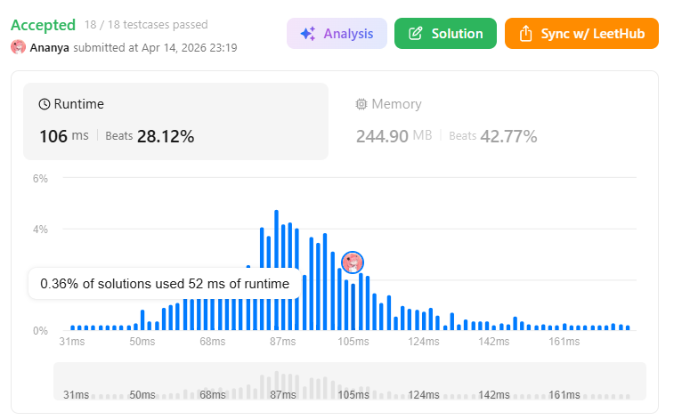
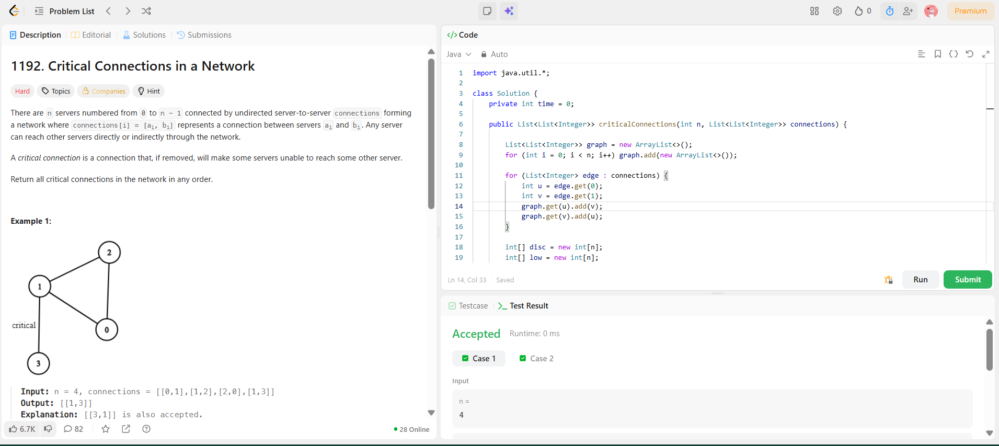

```
██████████████████████████████
  PLAYER    :  Ananya
  DATE      :  14-4-26
  DAY       :  24 / 30
██████████████████████████████

  MISSION   :  Critical Connections in a Network
  link      :  https://leetcode.com/problems/critical-connections-in-a-network/description/
  PLATFORM  :  LeetCode
  DIFFICULTY:  ★★★

  APPROACH  :  Intuition

We need to find edges which, if removed → graph breaks into components.

These edges are called bridges.

💡 Key Idea

While doing DFS, track two things:

1. disc[node]
Time when node is first visited
2. low[node]
Earliest (lowest) discovery time reachable from that node
(including back edges)
🚨 Bridge Condition

If:

low[neighbor] > disc[node]

👉 That edge is a critical connection (bridge)

Why?

Because:

Neighbor cannot reach node or any ancestor without this edge
So removing it disconnects graph
🧭 Approach (DFS + Timer)
Build adjacency list
Maintain:
disc[] (discovery time)
low[] (lowest reachable time)
visited[]
Run DFS
For each neighbor:
If not visited → DFS
Update low[node]
Check bridge condition
If visited and not parent → update low
🔥 Dry Run
Input:
n = 4
connections = [[0,1],[1,2],[2,0],[1,3]]

Graph:

0 — 1 — 3
 \  |
   2
DFS traversal

Start at 0:

Node	disc	low
0	1	1
1	2	2
2	3	3

Now:

2 → back edge to 0 → update low[2] = 1
1 → low[1] = min(2,1) = 1

Now visit 3:

Node	disc	low
3	4	4

Now check:

low[3] > disc[1]
4 > 2 ✅

👉 Edge (1,3) is a bridge
  TIME      :  O(V+E)
  SPACE     :  O(V+E)

  RESULT    :  ACCEPTED ✔
  VIBE      :  ★★★★★  too easy
  STREAK    :  [██████████░░] 24/30
██████████████████████████████
```

## 💻 Solution

```java
import java.util.*;

class Solution {
    private int time = 0;

    public List<List<Integer>> criticalConnections(int n, List<List<Integer>> connections) {
        
        List<List<Integer>> graph = new ArrayList<>();
        for (int i = 0; i < n; i++) graph.add(new ArrayList<>());

        for (List<Integer> edge : connections) {
            int u = edge.get(0);
            int v = edge.get(1);
            graph.get(u).add(v);
            graph.get(v).add(u);
        }

        int[] disc = new int[n];
        int[] low = new int[n];
        boolean[] visited = new boolean[n];

        List<List<Integer>> result = new ArrayList<>();

        dfs(0, -1, graph, disc, low, visited, result);

        return result;
    }

    private void dfs(int node, int parent, List<List<Integer>> graph,
                     int[] disc, int[] low, boolean[] visited,
                     List<List<Integer>> result) {

        visited[node] = true;
        disc[node] = low[node] = ++time;

        for (int neighbor : graph.get(node)) {

            if (neighbor == parent) continue;

            if (!visited[neighbor]) {
                dfs(neighbor, node, graph, disc, low, visited, result);

                low[node] = Math.min(low[node], low[neighbor]);

                if (low[neighbor] > disc[node]) {
                    result.add(Arrays.asList(node, neighbor));
                }

            } else {
                low[node] = Math.min(low[node], disc[neighbor]);
            }
        }
    }
}
```

## ✅ Accepted



## 🖥️ Code Screenshot


