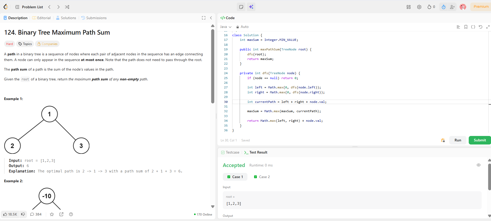

```
██████████████████████████████
  PLAYER    :  Ananya
  DATE      :  15-4-26
  DAY       :  25 / 30
██████████████████████████████

  MISSION   :  Binary Tree Maximum Path Sum
  link      :  https://leetcode.com/problems/binary-tree-maximum-path-sum/
  PLATFORM  :  LeetCode
  DIFFICULTY:  ★★★

  APPROACH  :  Core Intuition (THIS is the game)

At every node, you have two choices:

Continue the path upward (return value to parent)
Start a new path passing through this node (update global answer)

💡 Key realization:

A path can split at a node (left + node + right)
BUT when returning to parent → you can only pick one side
⚡ Strategy

For each node:

Get max gain from left subtree
Get max gain from right subtree

BUT:
👉 Ignore negative paths (they only reduce sum)

So:

left = max(0, left subtree gain)
right = max(0, right subtree gain)
🔥 At each node
1. Compute path THROUGH node:
currentPath = left + right + node.val

Update global max.

2. Return value to parent:
return max(left, right) + node.val

Because parent can only take ONE branch.

🧪 Dry Run (Example 2)

Tree:

       -10
       /  \
      9   20
         /  \
        15   7

At node 20:

left = 15
right = 7
👉 path = 15 + 20 + 7 = 42 (🔥 best)
⚠️ Important Edge Case

All nodes negative:

Example:

[-3]

👉 Answer = -3 (not 0)

Handled because:

maxSum initialized with Integer.MIN_VALUE

  TIME      :  O(N)
  SPACE     :  O(H)

  RESULT    :  ACCEPTED ✔
  VIBE      :  ★★★★★  too easy
  STREAK    :  [██████████░░] 25/30
██████████████████████████████
```

## 💻 Solution

```java
/**
 * Definition for a binary tree node.
 * public class TreeNode {
 *     int val;
 *     TreeNode left;
 *     TreeNode right;
 *     TreeNode() {}
 *     TreeNode(int val) { this.val = val; }
 *     TreeNode(int val, TreeNode left, TreeNode right) {
 *         this.val = val;
 *         this.left = left;
 *         this.right = right;
 *     }
 * }
 */
class Solution {
    int maxSum = Integer.MIN_VALUE;

    public int maxPathSum(TreeNode root) {
        dfs(root);
        return maxSum;
    }

    private int dfs(TreeNode node) {
        if (node == null) return 0;

        int left = Math.max(0, dfs(node.left));
        int right = Math.max(0, dfs(node.right));

        int currentPath = left + right + node.val;

        maxSum = Math.max(maxSum, currentPath);

        return Math.max(left, right) + node.val;
    }
}
```

## ✅ Accepted


## 🖥️ Code Screenshot


