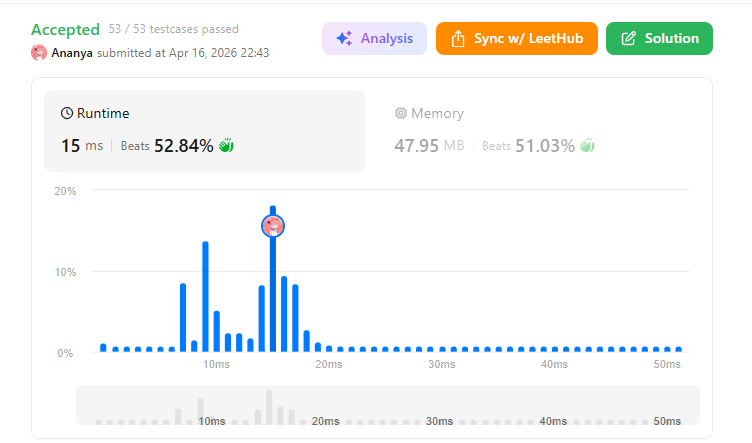
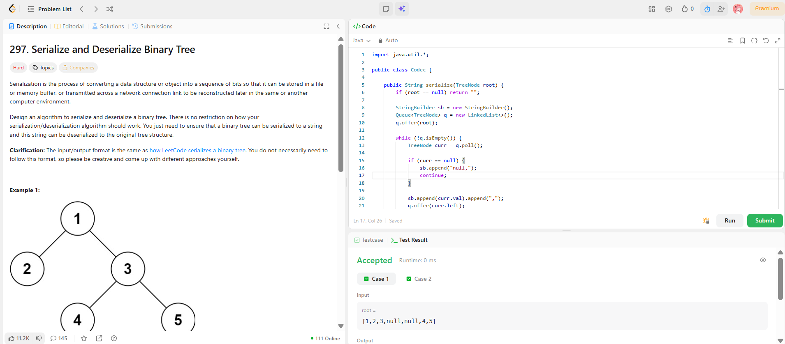

```
██████████████████████████████
  PLAYER    :  Ananya
  DATE      :  16-4-26
  DAY       :  26 / 30
██████████████████████████████

  MISSION   :  Serialize and Deserialize Binary Tree
  link      :  https://leetcode.com/problems/serialize-and-deserialize-binary-tree/description/
  PLATFORM  :  LeetCode
  DIFFICULTY:  ★★★

  APPROACH  :  Intuition (Think like this)

Imagine you're sending a tree over WhatsApp as text.

Problem:
👉 Tree has structure (left/right), not just values.

So you say:

“I’ll send nodes level by level… and wherever a child is missing, I’ll explicitly say null.”

Why?
Because without null, structure collapses.

🔑 Golden Rule

If you don’t store null, you lose the shape of the tree.

🌳 Example Tree
    1
   / \
  2   3
     / \
    4   5
🚀 Serialization (BFS Walkthrough)

We use a queue.

Step 1

Queue = [1]
Output = ""

Step 2

Pop 1
→ Add 1
→ Push 2, 3

Queue = [2,3]
Output = "1,"

Step 3

Pop 2
→ Add 2
→ Push null, null

Queue = [3,null,null]
Output = "1,2,"

Step 4

Pop 3
→ Add 3
→ Push 4, 5

Queue = [null,null,4,5]
Output = "1,2,3,"

Step 5

Pop null
→ Add "null"

Queue = [null,4,5]
Output = "1,2,3,null,"

Step 6

Pop null
→ Add "null"

Queue = [4,5]
Output = "1,2,3,null,null,"

Step 7

Pop 4
→ Add 4
→ Push null,null

Queue = [5,null,null]

Step 8

Pop 5
→ Add 5
→ Push null,null

Final Serialized String
"1,2,3,null,null,4,5,null,null,null,null"
What just happened?

You basically created a complete tree representation.

Even missing children are explicitly recorded.

🔄 Deserialization (Rebuild the Tree)

Now reverse the process.

Step 1

Split string:

[1,2,3,null,null,4,5,...]
Step 2

Create root:

root = 1
Queue = [1]
Step 3

Take next values in pairs

Iteration 1

Parent = 1

Left = 2
Right = 3

Queue = [2,3]

Tree:

    1
   / \
  2   3
Iteration 2

Parent = 2

Left = null
Right = null

Queue = [3]

Iteration 3

Parent = 3

Left = 4
Right = 5

Queue = [4,5]

Tree now:

    1
   / \
  2   3
     / \
    4   5
Iteration continues…

All nulls get skipped.

  TIME      :  O(n)
  SPACE     :  O(n)

  RESULT    :  ACCEPTED ✔
  VIBE      :  ★★★★★  too easy
  STREAK    :  [██████████░░] 26/30
██████████████████████████████
```

## 💻 Solution

```java
import java.util.*;

public class Codec {

    public String serialize(TreeNode root) {
        if (root == null) return "";

        StringBuilder sb = new StringBuilder();
        Queue<TreeNode> q = new LinkedList<>();
        q.offer(root);

        while (!q.isEmpty()) {
            TreeNode curr = q.poll();

            if (curr == null) {
                sb.append("null,");
                continue;
            }

            sb.append(curr.val).append(",");
            q.offer(curr.left);
            q.offer(curr.right);
        }

        return sb.toString();
    }

    public TreeNode deserialize(String data) {
        if (data == null || data.length() == 0) return null;

        String[] nodes = data.split(",");
        TreeNode root = new TreeNode(Integer.parseInt(nodes[0]));

        Queue<TreeNode> q = new LinkedList<>();
        q.offer(root);

        int i = 1;

        while (!q.isEmpty()) {
            TreeNode parent = q.poll();

            if (!nodes[i].equals("null")) {
                TreeNode left = new TreeNode(Integer.parseInt(nodes[i]));
                parent.left = left;
                q.offer(left);
            }
            i++;

            if (!nodes[i].equals("null")) {
                TreeNode right = new TreeNode(Integer.parseInt(nodes[i]));
                parent.right = right;
                q.offer(right);
            }
            i++;
        }

        return root;
    }
}
```

## ✅ Accepted



## 🖥️ Code Screenshot


