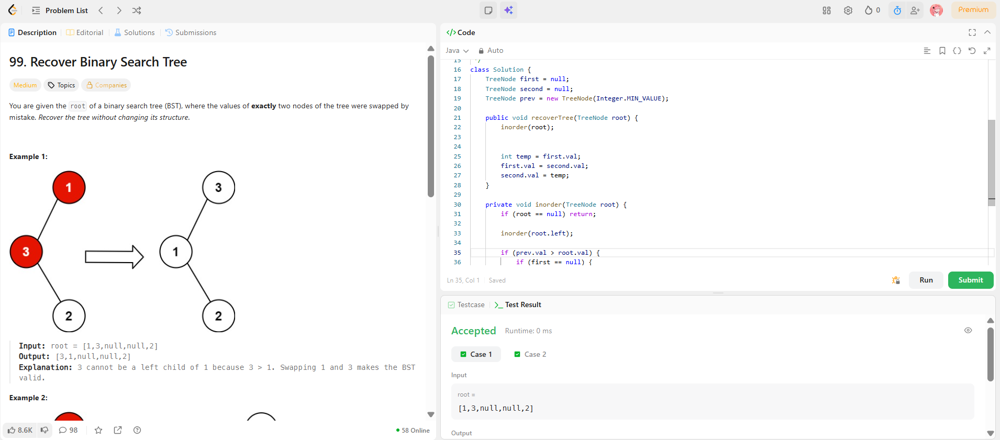

```
██████████████████████████████
  PLAYER    :  Ananya
  DATE      :  17-4-26
  DAY       :  27 / 30
██████████████████████████████

  MISSION   :  Recover Binary Search Tree
  link      :  https://leetcode.com/problems/recover-binary-search-tree/
  PLATFORM  :  LeetCode
  DIFFICULTY:  ★★★

  APPROACH  :  APPROACH (How to actually see the problem)
🔑 Key Idea

A BST’s inorder traversal is always sorted.

👉 If two nodes are swapped → the sorted order breaks.

💥 What does “break” look like?

While doing inorder:

prev < curr   ✅ normal
prev > curr   ❌ violation
🎯 Goal

Find the two nodes that are out of place.

🧩 Cases
1. Adjacent swap
1 3 2 4
   ↑ ↑

Only one violation

2. Non-adjacent swap
1 4 3 2
   ↑   ↑

Two violations

🧠 How we track

We maintain:

prev → previous node in inorder
first → first wrong node
second → second wrong node
⚙️ Logic

During inorder:

👉 If prev.val > curr.val

First time:
first = prev
Always:
second = curr
🔥 Why this works
First violation → identifies bigger wrong node
Second violation → identifies smaller wrong node
🧪 DRY RUN (Step-by-step like a boss)
Example:
Input: [3,1,4,null,null,2]

Tree:

     3
    / \
   1   4
      /
     2
🔄 Inorder traversal
Left → Root → Right

Sequence:

1 → 3 → 2 → 4
🧠 Step-by-step
Step 1:
curr = 1
prev = -∞

No issue

Step 2:
curr = 3
prev = 1

✅ 1 < 3 → ok

Step 3:
curr = 2
prev = 3

❌ VIOLATION: 3 > 2

👉 First time violation:

first = 3
second = 2
Step 4:
curr = 4
prev = 2

✅ 2 < 4 → ok

🎯 Final detected nodes:
first = 3
second = 2
🔁 Swap them
3 ↔ 2

Tree becomes:

     2
    / \
   1   4
      /
     3
✅ Correct inorder now:
1 → 2 → 3 → 4

Sorted again. Boom.

⚡ Another quick example (Non-adjacent case)
Input inorder: 1 4 3 2
Step-by-step:
4 > 3 → first = 4, second = 3
3 > 2 → second = 2 (updated)

👉 Final:

first = 4
second = 2

  TIME      :  O(n)
  SPACE     :  O(h)

  RESULT    :  ACCEPTED ✔
  VIBE      :  ★★★★★  too easy
  STREAK    :  [███████████░] 28/30
██████████████████████████████
```

## 💻 Solution

```java
class Solution {
    TreeNode first = null;
    TreeNode second = null;
    TreeNode prev = new TreeNode(Integer.MIN_VALUE);

    public void recoverTree(TreeNode root) {
        inorder(root);

        // swap values
        int temp = first.val;
        first.val = second.val;
        second.val = temp;
    }

    private void inorder(TreeNode root) {
        if (root == null) return;

        inorder(root.left);

        // violation check
        if (prev.val > root.val) {
            if (first == null) {
                first = prev;
            }
            second = root;
        }

        prev = root;

        inorder(root.right);
    }
}
```

## ✅ Accepted


## 🖥️ Code Screenshot


