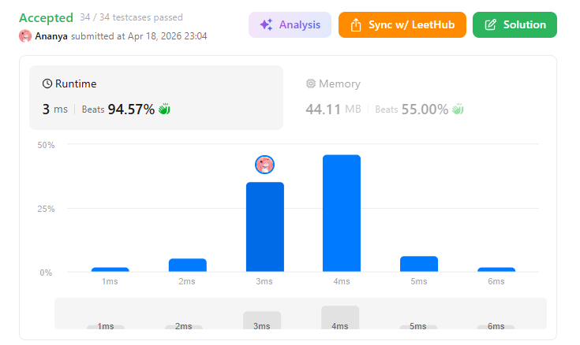
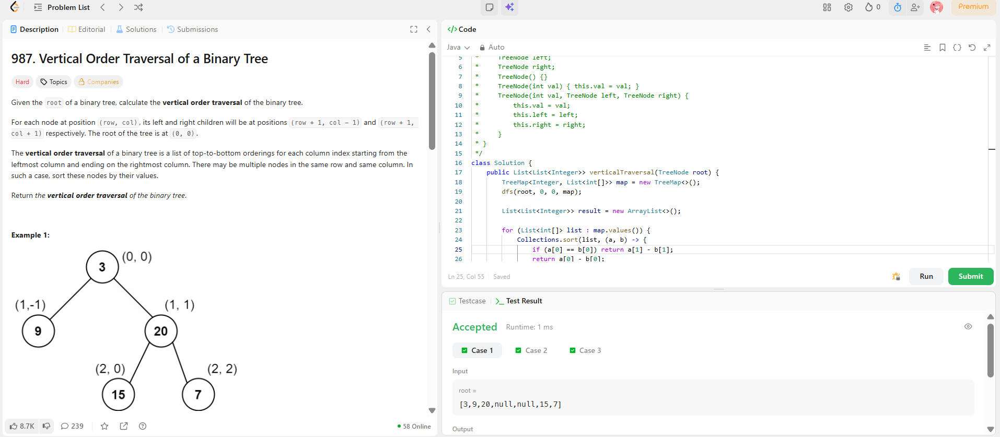

```
██████████████████████████████
  PLAYER    :  Ananya
  DATE      :  18-4-26
  DAY       :  28 / 30
██████████████████████████████

  MISSION   :  Vertical Order Traversal of a Binary Tree
  link      :  https://leetcode.com/problems/vertical-order-traversal-of-a-binary-tree/description/
  PLATFORM  :  LeetCode
  DIFFICULTY:  ★★★

  APPROACH  :  Intuition (core idea)

Think of every node having a (row, col) coordinate:

Root → (0, 0)
Left → (row+1, col-1)
Right → (row+1, col+1)

Now the problem reduces to:

👉 “Group nodes by column”
👉 “Sort inside each column properly”

⚙️ Rules you MUST follow

Inside each column:

Sort by row (top → bottom)
If same row → sort by value (ascending)
🚀 Approach (clean & interview-ready)
Step 1: Traverse tree (DFS)

Store nodes as:

(col, row, value)
Step 2: Use a structure
TreeMap<Integer, List<int[]>> map;
Key = column
Value = list of {row, value}

TreeMap automatically keeps columns sorted (left → right)

Step 3: Sort each column

Sort list by:

if(row same) → value ascending
else → row ascending
Step 4: Build result

Extract values column-wise

🔍 Dry Run (Example 2)
Input:
        1
      /   \
     2     3
    / \   / \
   4  5  6   7
Step 1: Assign coordinates
Node	Row	Col
1	0	0
2	1	-1
3	1	1
4	2	-2
5	2	0
6	2	0
7	2	2
Step 2: Group by column
-2 → [4]
-1 → [2]
 0 → [1,5,6]
 1 → [3]
 2 → [7]
Step 3: Sort column 0

Nodes at col 0:

(0,1), (2,5), (2,6)
First by row → OK
Same row → sort by value → 5 before 6
Step 4: Final Answer
[[4],[2],[1,5,6],[3],[7]]

  TIME      :  O(n log n)
  SPACE     :  O(n)

  RESULT    :  ACCEPTED ✔
  VIBE      :  ★★★★★  too easy
  STREAK    :  [███████████░] 28/30
██████████████████████████████
```

## 💻 Solution

```java
/**
 * Definition for a binary tree node.
 * public class TreeNode {
 *     int val;
 *     TreeNode left;
 *     TreeNode right;
 *     TreeNode() {}
 *     TreeNode(int val) { this.val = val; }
 *     TreeNode(int val, TreeNode left, TreeNode right) {
 *         this.val = val;
 *         this.left = left;
 *         this.right = right;
 *     }
 * }
 */
class Solution {
    public List<List<Integer>> verticalTraversal(TreeNode root) {
        TreeMap<Integer, List<int[]>> map = new TreeMap<>();
        dfs(root, 0, 0, map);

        List<List<Integer>> result = new ArrayList<>();

        for (List<int[]> list : map.values()) {
            Collections.sort(list, (a, b) -> {
                if (a[0] == b[0]) return a[1] - b[1]; 
                return a[0] - b[0];
            });

            List<Integer> col = new ArrayList<>();
            for (int[] arr : list) {
                col.add(arr[1]);
            }
            result.add(col);
        }

        return result;
    }

    private void dfs(TreeNode node, int row, int col, 
                     TreeMap<Integer, List<int[]>> map) {
        if (node == null) return;

        map.putIfAbsent(col, new ArrayList<>());
        map.get(col).add(new int[]{row, node.val});

        dfs(node.left, row + 1, col - 1, map);
        dfs(node.right, row + 1, col + 1, map);
    }
}

```

## ✅ Accepted



## 🖥️ Code Screenshot


