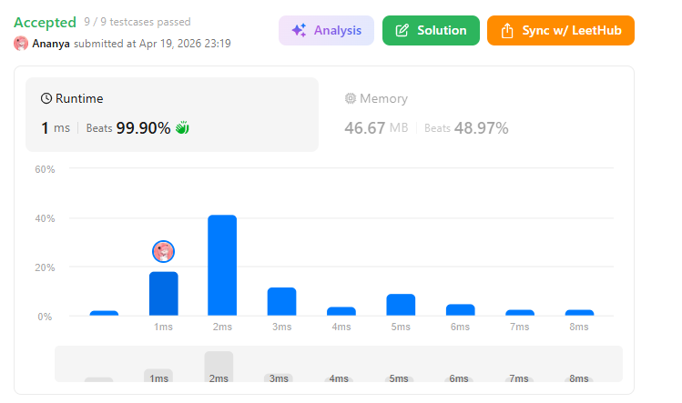
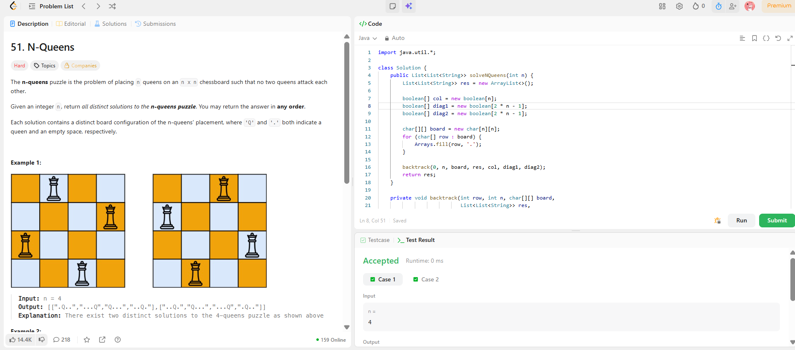

```
██████████████████████████████
  PLAYER    :  Ananya
  DATE      :  19-4-26
  DAY       :  29 / 30
██████████████████████████████

  MISSION   :  N Queens
  link      :  https://leetcode.com/problems/n-queens/description/
  PLATFORM  :  LeetCode
  DIFFICULTY:  ★★★

  APPROACH  :  Core Idea (Approach)

You need to place n queens on n×n board such that:

No two queens share:
same row ✅ (we handle this automatically)
same column ❌
same diagonal ❌
🔥 Key Insight

We place one queen per row, and try all columns.

At each step:

Try placing queen at (row, col)
Check if it's safe
If safe → move to next row
If stuck → backtrack
🧠 How to Check Safety (O(1))

Instead of scanning board every time (slow ❌), we use 3 arrays:

boolean[] col;       // columns
boolean[] diag1;     // row + col
boolean[] diag2;     // row - col + (n-1)

👉 Why?

Same column → col[c]
Same diagonal:
/ diagonal → row + col
\ diagonal → row - col

🧪 Dry Run (n = 4)

We go row by row.

Step 1: Row 0

Try columns:

Place at (0,0) ✅
Q . . .
. . . .
. . . .
. . . .
Step 2: Row 1

Try columns:

(1,0) ❌ same column
(1,1) ❌ diagonal
(1,2) ✅
Q . . .
. . Q .
. . . .
. . . .
Step 3: Row 2

Try all columns → NONE work ❌

👉 Dead end → BACKTRACK

Step 4: Row 1 (continue)

Try next:

(1,3) ✅
Q . . .
. . . Q
. . . .
. . . .
Step 5: Row 2

Try:

(2,1) ✅
Q . . .
. . . Q
. Q . .
. . . .
Step 6: Row 3

Try:

(3,2) ❌ diagonal
(3,0) ❌ column
(3,3) ❌ column
(3,1) ❌ column

👉 Dead end → backtrack again

Eventually you reach:

✅ Solution 1:
. Q . .
. . . Q
Q . . .
. . Q .
✅ Solution 2:
. . Q .
Q . . .
. . . Q
. Q . .

  TIME      :  O(n!)
  SPACE     :  O(n)

  RESULT    :  ACCEPTED ✔
  VIBE      :  ★★★★★  too easy
  STREAK    :  [████████████] 29/30
██████████████████████████████
```

## 💻 Solution

```java
import java.util.*;

class Solution {
    public List<List<String>> solveNQueens(int n) {
        List<List<String>> res = new ArrayList<>();
        
        boolean[] col = new boolean[n];
        boolean[] diag1 = new boolean[2 * n - 1]; 
        boolean[] diag2 = new boolean[2 * n - 1];
        
        char[][] board = new char[n][n];
        for (char[] row : board) {
            Arrays.fill(row, '.');
        }
        
        backtrack(0, n, board, res, col, diag1, diag2);
        return res;
    }
    
    private void backtrack(int row, int n, char[][] board, 
                           List<List<String>> res,
                           boolean[] col, boolean[] diag1, boolean[] diag2) {
        
        if (row == n) {
            res.add(construct(board));
            return;
        }
        
        for (int c = 0; c < n; c++) {
            if (col[c] || diag1[row + c] || diag2[row - c + n - 1]) {
                continue;
            }
            
            board[row][c] = 'Q';
            col[c] = true;
            diag1[row + c] = true;
            diag2[row - c + n - 1] = true;
            
            backtrack(row + 1, n, board, res, col, diag1, diag2);
            
            // backtrack
            board[row][c] = '.';
            col[c] = false;
            diag1[row + c] = false;
            diag2[row - c + n - 1] = false;
        }
    }
    
    private List<String> construct(char[][] board) {
        List<String> list = new ArrayList<>();
        for (char[] row : board) {
            list.add(new String(row));
        }
        return list;
    }
}

```

## ✅ Accepted



## 🖥️ Code Screenshot


