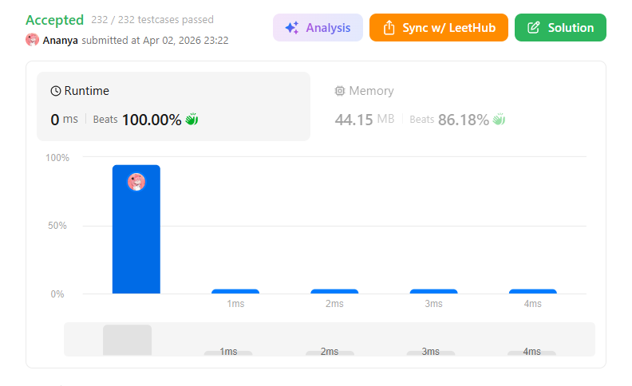
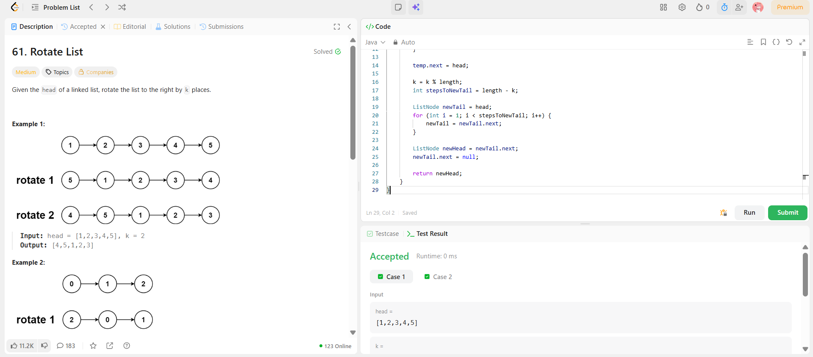

```
██████████████████████████████
  PLAYER    :  Ananya
  DATE      :  2-4-26
  DAY       :  12 / 30
██████████████████████████████

  MISSION   :  Rotate List
  link      :  https://leetcode.com/problems/rotate-list/description/
  PLATFORM  :  LeetCode
  DIFFICULTY:  ★★☆

  APPROACH  :  Approach + Intuition + Dry Run (Rotate List)
🔥 Intuition:

Brute force rotation (shifting one by one) takes O(k × n) → trash for large k ❌

Instead, think smart:
👉 Rotating right by k means moving last k nodes to front
👉 This can be done in one pass using a circular list

⚡ Approach:
Edge Case:
If list is empty or has 1 node → return head
Find Length (n):
Traverse list to count nodes
Optimize k:
k = k % n
If k == 0 → no rotation needed
Make List Circular:
Connect last node → head
Find New Tail:
Move (n - k - 1) steps from head
Find New Head:
newHead = newTail.next
Break the Circle:
newTail.next = null
🧪 Dry Run:
Input:

1 → 2 → 3 → 4 → 5,  k = 2

Step 1: Length

n = 5

Step 2: Optimize k

k = 2 % 5 = 2

Step 3: Make Circular
1 → 2 → 3 → 4 → 5
↑                 ↓
← ← ← ← ← ← ← ← ←
Step 4: Find New Tail

Move n - k - 1 = 5 - 2 - 1 = 2 steps
👉 New Tail = 3

Step 5: New Head

👉 New Head = 4

Step 6: Break

Final:

4 → 5 → 1 → 2 → 3

  TIME      :  O(n)
  SPACE     :  O(1)

  RESULT    :  ACCEPTED ✔
  VIBE      :  ★★★★★  too easy
  STREAK    :  [█████░░░░░░░] 12/30
██████████████████████████████
```

## 💻 Solution

```java
class Solution {
    public ListNode rotateRight(ListNode head, int k) {
        if (head == null || head.next == null || k == 0) {
            return head;
        }

        ListNode temp = head;
        int length = 1;
        while (temp.next != null) {
            temp = temp.next;
            length++;
        }

        temp.next = head;

        k = k % length;
        int stepsToNewTail = length - k;

        ListNode newTail = head;
        for (int i = 1; i < stepsToNewTail; i++) {
            newTail = newTail.next;
        }

        ListNode newHead = newTail.next;
        newTail.next = null;

        return newHead;
    }
}

```

## ✅ Accepted



## 🖥️ Code Screenshot


