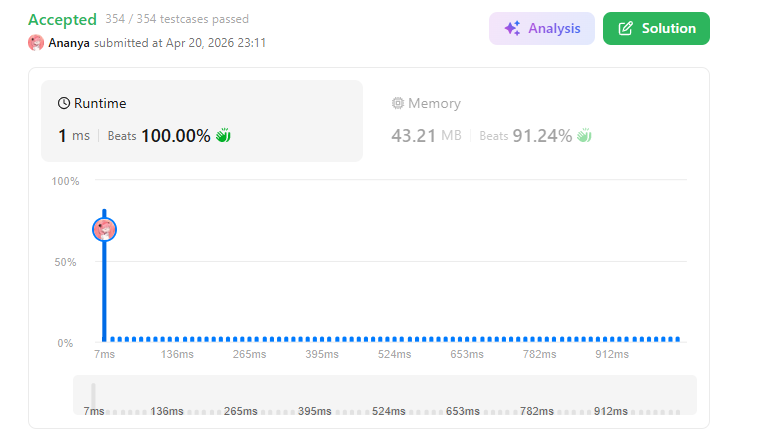
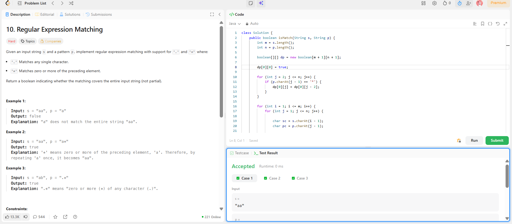

```
██████████████████████████████
  PLAYER    :  Ananya
  DATE      :  20-4-26
  DAY       :  30 / 30
██████████████████████████████

  MISSION   :  Regular Expression Matching
  link      :  https://leetcode.com/problems/regular-expression-matching/description/
  PLATFORM  :  LeetCode
  DIFFICULTY:  ★★★

  APPROACH  :  Approach (Think Like a Pro)

We define:

dp[i][j] = does s[0..i-1] match p[0..j-1]

🔥 Cases to Handle
1. Direct match or .

If:

s[i-1] == p[j-1] OR p[j-1] == '.'

➡️ Carry previous result:

dp[i][j] = dp[i-1][j-1]
2. When * appears

Pattern: x*

We get 2 options:

✅ Ignore x* (0 occurrence)
dp[i][j] = dp[i][j-2]
✅ Use x* (1+ occurrence)

Only if:

s[i-1] == x OR x == '.'

Then:

dp[i][j] |= dp[i-1][j]


🧪 Dry Run (Step-by-Step 🔥)
Input:
s = "aa"
p = "a*"
🧱 DP Table
i\j	""	a	*
""	T	F	T
a	F	T	T
aa	F	F	T
⚡ Step Breakdown
1. Initialization
dp[0][0] = true
2. Handle empty string with pattern
p = "a*"
dp[0][2] = dp[0][0] = true
3. Fill table
i=1 ("a")
j=1 ('a'):
match → dp[1][1] = dp[0][0] = true
j=2 ('*'):
ignore → dp[1][2] = dp[1][0] = false
use → matches → dp[0][2] = true

=> dp[1][2] = true
i=2 ("aa")
j=1 ('a'):
dp[2][1] = dp[1][0] = false
j=2 ('*'):
ignore → dp[2][0] = false
use → matches → dp[1][2] = true

=> dp[2][2] = true
✅ Final Answer
dp[2][2] = true

  TIME      :  O(m*n)
  SPACE     :  O(m*n)

  RESULT    :  ACCEPTED ✔
  VIBE      :  ★★★★★  too easy
  STREAK    :  [████████████] 30/30
██████████████████████████████
```

## 💻 Solution

```java
class Solution {
    public boolean isMatch(String s, String p) {
        int m = s.length();
        int n = p.length();

        boolean[][] dp = new boolean[m + 1][n + 1];

        dp[0][0] = true;

        for (int j = 2; j <= n; j++) {
            if (p.charAt(j - 1) == '*') {
                dp[0][j] = dp[0][j - 2];
            }
        }

        for (int i = 1; i <= m; i++) {
            for (int j = 1; j <= n; j++) {

                char sc = s.charAt(i - 1);
                char pc = p.charAt(j - 1);

                if (sc == pc || pc == '.') {
                    dp[i][j] = dp[i - 1][j - 1];
                }

                else if (pc == '*') {
                    dp[i][j] = dp[i][j - 2];

                    char prev = p.charAt(j - 2);

                    if (prev == sc || prev == '.') {
                        dp[i][j] = dp[i][j] || dp[i - 1][j];
                    }
                }
            }
        }

        return dp[m][n];
    }
}
```

## ✅ Accepted



## 🖥️ Code Screenshot


