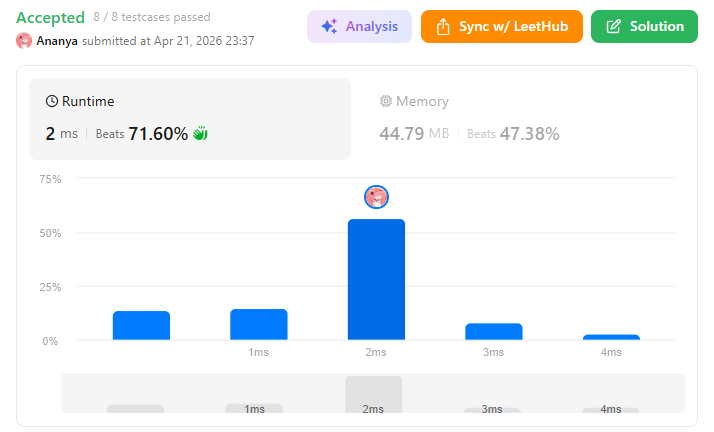
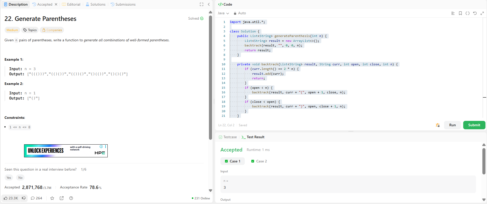

```
██████████████████████████████
  PLAYER    :  Ananya
  DATE      :  21-4-26
  DAY       :  31 / 30
██████████████████████████████

  MISSION   :  Generate Parentheses
  link      :  https://leetcode.com/problems/generate-parentheses/description/
  PLATFORM  :  LeetCode
  DIFFICULTY:  ★★☆

  APPROACH  :  Approach (simple + clear)

We build the string step by step using recursion.

Rules:
You can add '(' only if open < n
You can add ')' only if close < open (important ⚠️)

👉 Why?

You can't close more than you open → invalid
You can't exceed total pairs → obvious
🔁 Backtracking Idea

At every step:

Try adding '('
Try adding ')'
Stop when length = 2 * n

Dry Run (n = 3)
Let’s walk through like a boss 🧠
Start:
curr = "", open = 0, close = 0

Step 1:
Add '('
"("open = 1, close = 0

Step 2:
Add '('
"(("open = 2, close = 0

Step 3:
Add '('
"((("open = 3, close = 0

Step 4:
Only ')' allowed now
"((()"
→ Continue:
"((())""((()))" ✅ (valid → add to result)

Backtrack 🔙
Try different paths:
From "((" → instead of '(', try ')'
"(()"
Continue:
"(()(""(()()""(()())" ✅

More paths:
"(())()""()(())""()()()"

✅ Final Output
["((()))","(()())","(())()","()(())","()()()"]

  TIME      :   O(4^n / √n)
  SPACE     :  O(n)

  RESULT    :  ACCEPTED ✔
  VIBE      :  ★★★★★  too easy
  STREAK    :  [████████████] 32/30
██████████████████████████████
```

## 💻 Solution

```java
import java.util.*;

class Solution {
    public List<String> generateParenthesis(int n) {
        List<String> result = new ArrayList<>();
        backtrack(result, "", 0, 0, n);
        return result;
    }

    private void backtrack(List<String> result, String curr, int open, int close, int n) {
        if (curr.length() == 2 * n) {
            result.add(curr);
            return;
        }
        if (open < n) {
            backtrack(result, curr + "(", open + 1, close, n);
        }
        if (close < open) {
            backtrack(result, curr + ")", open, close + 1, n);
        }
    }
}
```

## ✅ Accepted



## 🖥️ Code Screenshot


