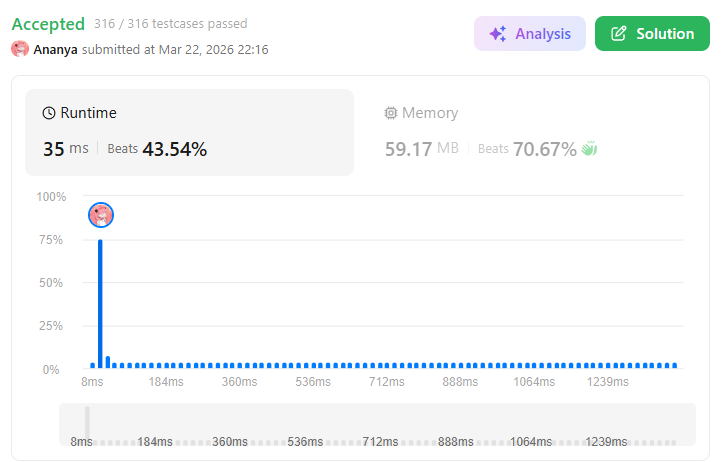
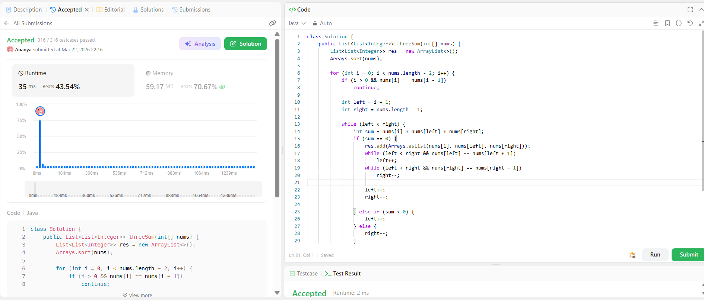

```
██████████████████████████████
  PLAYER    :  Ananya
  DATE      :  22-3-26
  DAY       :  01 / 30
██████████████████████████████

  MISSION   :  3 Sum
  link      :  https://leetcode.com/problems/3sum/description/
  PLATFORM  :  LeetCode
  DIFFICULTY:  ★★☆

  APPROACH  :  Approach + Intuition + Dry Run (3Sum Problem)

Intuition:
The brute force approach checks all triplets and takes O(n³), which is inefficient.
To optimize, we observe that if we fix one element, the problem reduces to finding two numbers whose sum equals the negative of the fixed element.
Thus, 3Sum can be reduced to a 2Sum problem using the two-pointer technique.

Approach:
1. Sort the array.

2. Iterate through the array and fix one element `nums[i]`.

3. For each `i`, use two pointers:
`left = i + 1`
`right = n - 1`

4. While `left < right`:
 Compute sum = `nums[i] + nums[left] + nums[right]`
 If sum == 0 → add triplet to result
 If sum < 0 → move `left` forward
 If sum > 0 → move `right` backward

5. Skip duplicates:
 If `nums[i] == nums[i-1]`, skip iteration
 After finding a triplet, skip duplicate values of `left` and `right`

Dry Run:
Input: [-1, 0, 1, 2, -1, -4]

After sorting:
[-4, -1, -1, 0, 1, 2]

 i = 0 → nums[i] = -4 → no valid triplet found

  i = 1 → nums[i] = -1
  left = 2, right = 5
  sum = -1 + (-1) + 2 = 0 → add [-1, -1, 2]
  move pointers

  left = 3, right = 4
  sum = -1 + 0 + 1 = 0 → add [-1, 0, 1]

 i = 2 → duplicate → skip

Final Output:
[[-1, -1, 2], [-1, 0, 1]]


  TIME      :  O(n²)
  SPACE     :  O(1) (excluding output)

  RESULT    :  ACCEPTED ✔
  VIBE      :  ★★★★★  too easy
  STREAK    :  [░░░░░░░░░░░░] 1/30
██████████████████████████████
```

## 💻 Solution

```java
class Solution {
    public List<List<Integer>> threeSum(int[] nums) {
        List<List<Integer>> res = new ArrayList<>();
        Arrays.sort(nums);

        for (int i = 0; i < nums.length - 2; i++) {
            if (i > 0 && nums[i] == nums[i - 1])
                continue;

            int left = i + 1;
            int right = nums.length - 1;

            while (left < right) {
                int sum = nums[i] + nums[left] + nums[right];
                if (sum == 0) {
                    res.add(Arrays.asList(nums[i], nums[left], nums[right]));
                    while (left < right && nums[left] == nums[left + 1]) 
                        left++;
                    while (left < right && nums[right] == nums[right - 1]) 
                        right--;

                    left++;
                    right--;

                } else if (sum < 0) {
                    left++;
                } else {
                    right--;
                }
            }
        }
        return res;
    }
}
```

## ✅ Accepted



## 🖥️ Code Screenshot


