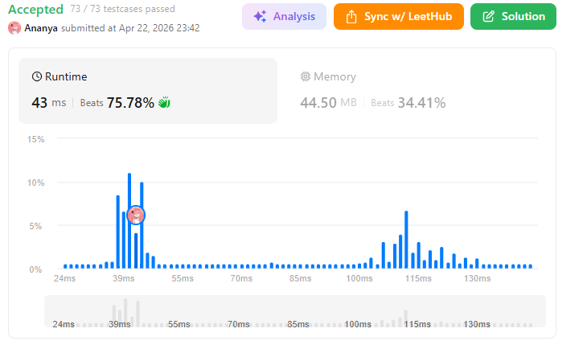
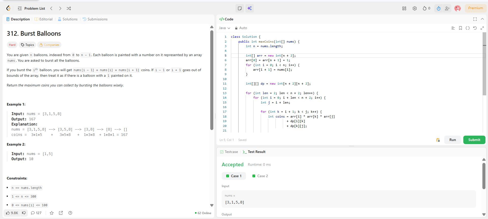

```
██████████████████████████████
  PLAYER    :  Ananya
  DATE      :  22-4-26
  DAY       :  32 / 30
██████████████████████████████

  MISSION   :  Burst Balloons
  link      :  https://leetcode.com/problems/burst-balloons/description/
  PLATFORM  :  LeetCode
  DIFFICULTY:  ★★★

  APPROACH  :  Core Idea (Interval DP)

When you burst balloon k last in a range (i, j):

Left side (i → k) is already solved
Right side (k → j) is already solved
Only neighbors left are i and j

So coins =
nums[i] * nums[k] * nums[j]

⚡ Preprocessing Trick

Add 1 at both ends:

nums = [3,1,5,8]
→ arr = [1,3,1,5,8,1]

Now no boundary headache.

🧩 DP Definition
dp[i][j] = max coins from bursting balloons between i and j (exclusive)

We try every k between (i, j) as last balloon:

dp[i][j] = max(
    dp[i][k] + dp[k][j] + arr[i]*arr[k]*arr[j]
)

Dry Run (nums = [3,1,5,8])
Step 1:
arr = [1,3,1,5,8,1]
Step 2: Build DP gradually
Length = 2 (only one balloon inside)
dp[i][i+2] = arr[i] * arr[i+1] * arr[i+2]

dp[0][2] = 1*3*1 = 3
dp[1][3] = 3*1*5 = 15
dp[2][4] = 1*5*8 = 40
dp[3][5] = 5*8*1 = 40
Length = 3

Example:

dp[0][3]:

k = 1 → 1*3*5 + dp[0][1] + dp[1][3] = 15 + 0 + 15 = 30
k = 2 → 1*1*5 + dp[0][2] + dp[2][3] = 5 + 3 + 0 = 8

→ max = 30
Continue filling...

Eventually:

dp[0][5] = 167

  TIME      :  O(n³)
  SPACE     :  O(n²)

  RESULT    :  ACCEPTED ✔
  VIBE      :  ★★★★★  too easy
  STREAK    :  [████████████] 33/30
██████████████████████████████
```

## 💻 Solution

```java
class Solution {
    public int maxCoins(int[] nums) {
        int n = nums.length;

        int[] arr = new int[n + 2];
        arr[0] = arr[n + 1] = 1;
        for (int i = 0; i < n; i++) {
            arr[i + 1] = nums[i];
        }

        int[][] dp = new int[n + 2][n + 2];

        for (int len = 2; len < n + 2; len++) {
            for (int i = 0; i + len < n + 2; i++) {
                int j = i + len;

                for (int k = i + 1; k < j; k++) {
                    int coins = arr[i] * arr[k] * arr[j]
                              + dp[i][k]
                              + dp[k][j];

                    dp[i][j] = Math.max(dp[i][j], coins);
                }
            }
        }

        return dp[0][n + 1];
    }
}
```

## ✅ Accepted



## 🖥️ Code Screenshot


