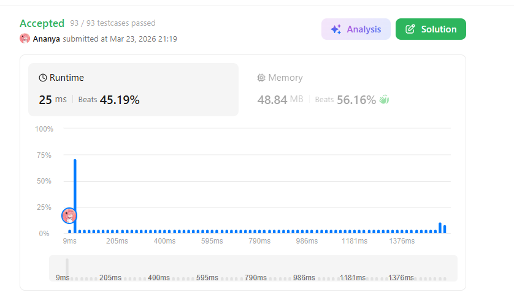
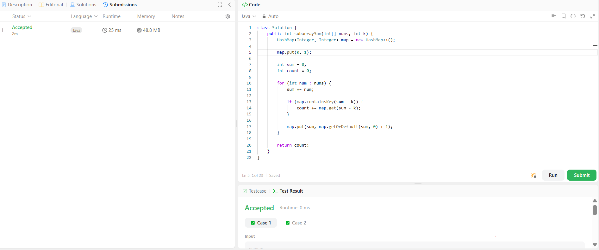

```
██████████████████████████████
  PLAYER    :  Ananya
  DATE      :  23-03-26
  DAY       :  02 / 30
██████████████████████████████

  MISSION   :  Subarray Sum Equals K
  link      :  https://leetcode.com/problems/subarray-sum-equals-k/description/
  PLATFORM  :  LeetCode
  DIFFICULTY:  ★★☆

  APPROACH  :  APPROACH : Approach + Intuition + Dry Run (Subarray Sum Equals K)

Intuition:
The brute force approach checks all possible subarrays, which takes O(n²) time and is inefficient.
To optimize, we use prefix sum + hashmap.

Key observation:
If at some index the current sum = sum, and there exists a previous prefix sum = (sum - k),
then the subarray between those indices has sum = k.

Because:
sum - (sum - k) = k

Approach:
Take a variable sum to maintain the running prefix sum.

Use a hashmap:
Key = prefix sum
Value = frequency (how many times it occurred)

Initialize:
map.put(0, 1)
(This handles cases where subarray starts from index 0)

Traverse the array:
For each element:
sum += nums[i]

Check:
if (sum - k) exists in map
→ count += map.get(sum - k)

Update hashmap:
map.put(sum, map.getOrDefault(sum, 0) + 1)
Return count

Dry Run:
Input:
nums = [1, 1, 1], k = 2

Initial:
sum = 0
count = 0
map = {0:1}

i = 0 → nums[i] = 1
sum = 1
sum - k = -1 → not found
map = {0:1, 1:1}

i = 1 → nums[i] = 1
sum = 2
sum - k = 0 → found (1 time)
count = 1
map = {0:1, 1:1, 2:1}

i = 2 → nums[i] = 1
sum = 3
sum - k = 1 → found (1 time)
count = 2

Final Output:
2

  TIME      :  O(n)
  SPACE     :  O(n)

  RESULT    :  ACCEPTED ✔
  VIBE      :  ★★★★★  too easy
  STREAK    :  [█░░░░░░░░░░░] 2/30
██████████████████████████████
```

## 💻 Solution

```java
class Solution {
    public int subarraySum(int[] nums, int k) {
        HashMap<Integer, Integer> map = new HashMap<>();

        map.put(0, 1);

        int sum = 0;
        int count = 0;

        for (int num : nums) {
            sum += num;

            if (map.containsKey(sum - k)) {
                count += map.get(sum - k);
            }

            map.put(sum, map.getOrDefault(sum, 0) + 1);
        }

        return count;
    }
}
```

## ✅ Accepted



## 🖥️ Code Screenshot


