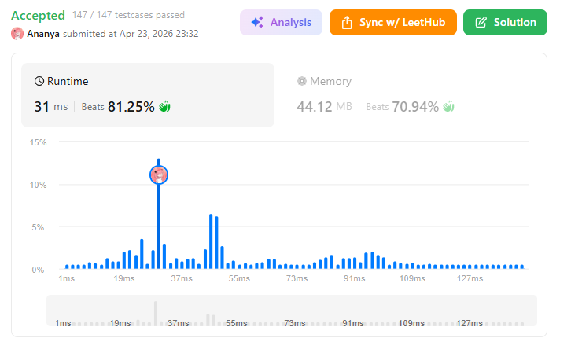
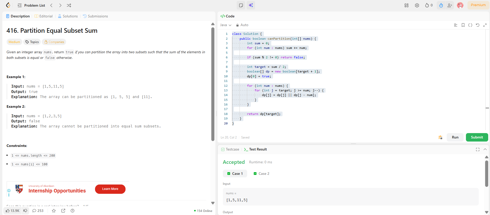

```
██████████████████████████████
  PLAYER    :  Ananya
  DATE      :  23-4-26
  DAY       :  33 / 30
██████████████████████████████

  MISSION   :  Partition Equal Subset Sum
  link      :  https://leetcode.com/problems/partition-equal-subset-sum/
  PLATFORM  :  LeetCode
  DIFFICULTY:  ★★☆

  APPROACH  :  Intuition (why this works)

You’re trying to split the array into 2 equal halves.

So first thought:
👉 “What’s the total sum?”

If sum is odd → impossible (you can’t split 15 into 7.5 + 7.5) ❌
If sum is even → target = sum / 2

Now the real question becomes:

👉 Can I pick some elements that add up to target?

If YES → remaining elements automatically form the other half.

⚙️ Approach (DP / Knapsack mindset)

We use a boolean array:

dp[j] = can we make sum j using some elements?
Step-by-step:
Initialize:
dp[0] = true   // sum 0 is always possible (pick nothing)
For each number:
Try to update possible sums
Transition:
dp[j] = dp[j] OR dp[j - num]
⚠️ Important Trick

Loop backwards:

for (j = target → num)

👉 Why?
So each number is used only once (0/1 knapsack logic)

🧪 Dry Run (step-by-step)

Input:

nums = [1, 5, 11, 5]
Step 1: total sum
sum = 22 → target = 11
Step 2: DP array
dp = [true, false, false, ..., false]  (size = 12)
index = 0 → 11
Step 3: Process elements
➤ Take 1:
dp[1] = dp[1] OR dp[0] → true

Now:

[ T, T, F, F, F, F, F, F, F, F, F, F ]
➤ Take 5:
dp[5] = dp[5] OR dp[0] → true
dp[6] = dp[6] OR dp[1] → true

Now:

[ T, T, F, F, F, T, T, F, F, F, F, F ]
➤ Take 11:
dp[11] = dp[11] OR dp[0] → true

Boom 💥 target reached

➤ Last 5 (not even needed anymore)

We already got dp[11] = true

  TIME      :  O(n * sum/2)
  SPACE     :  O(sum/2)

  RESULT    :  ACCEPTED ✔
  VIBE      :  ★★★★★  too easy
  STREAK    :  [████████████] 33/30
██████████████████████████████
```

## 💻 Solution

```java
class Solution {
    public boolean canPartition(int[] nums) {
        int sum = 0;
        for (int num : nums) sum += num;

        if (sum % 2 != 0) return false;

        int target = sum / 2;
        boolean[] dp = new boolean[target + 1];
        dp[0] = true;

        for (int num : nums) {
            for (int j = target; j >= num; j--) {
                dp[j] = dp[j] || dp[j - num];
            }
        }

        return dp[target];
    }
}

```

## ✅ Accepted



## 🖥️ Code Screenshot


