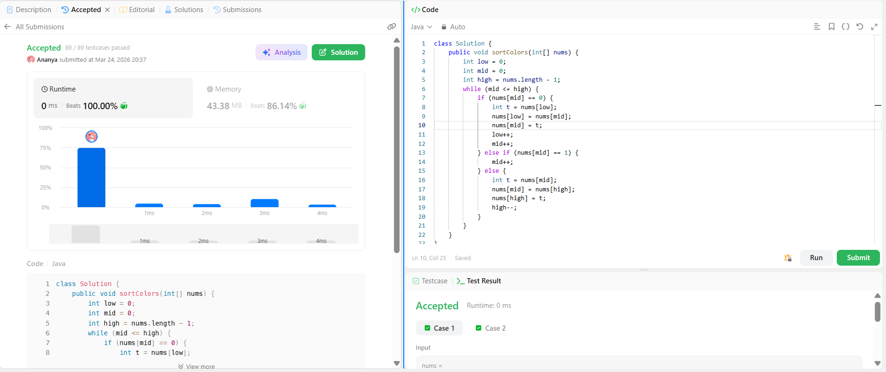

```
██████████████████████████████
  PLAYER    :  Ananya
  DATE      :  24-3-26
  DAY       :  03 / 30
██████████████████████████████

  MISSION   :  Sort Colors
  link      :  https://leetcode.com/problems/sort-colors/description/
  PLATFORM  :  LeetCode
  DIFFICULTY:  ★★☆

  APPROACH  :  Approach + Intuition + Dry Run (Sort Colors)

Intuition:
Since the array contains only three values (0, 1, 2), we don’t need a general sorting algorithm.
We can sort the array in a single pass by placing elements in their correct regions:
0 → beginning
1 → middle
2 → end
We use three pointers to maintain these regions efficiently.

Approach:

We maintain three pointers:
low → next position for 0
mid → current element
high → next position for 2

Initialize:
low = 0, mid = 0, high = n - 1

Traverse the array while mid <= high:
If nums[mid] == 0
→ Swap nums[mid] with nums[low]
→ Increment both low and mid
If nums[mid] == 1
→ Element is already in correct position
→ Increment mid
If nums[mid] == 2
→ Swap nums[mid] with nums[high]
→ Decrement high
→ Do not increment mid (recheck swapped element)

Dry Run:

Input:
nums = [2,0,2,1,1,0]

Steps:
low=0, mid=0, high=5

[2,0,2,1,1,0]
nums[mid]=2 → swap(mid, high)
[0,0,2,1,1,2]
high=4

nums[mid]=0 → swap(mid, low)
[0,0,2,1,1,2]
low=1, mid=1

nums[mid]=0 → swap(mid, low)
[0,0,2,1,1,2]
low=2, mid=2

nums[mid]=2 → swap(mid, high)
[0,0,1,1,2,2]
high=3

nums[mid]=1 → mid=3
nums[mid]=1 → mid=4 (stop)

Output:
[0,0,1,1,2,2]

  TIME      :  O(n)
  SPACE     :  O(1)

  RESULT    :  ACCEPTED ✔
  VIBE      :  ★★★★★  too easy
  STREAK    :  [█░░░░░░░░░░░] 3/30
██████████████████████████████
```

## 💻 Solution

```python
class Solution {
    public void sortColors(int[] nums) {
        int low = 0;
        int mid = 0;
        int high = nums.length - 1;
        while (mid <= high) {
            if (nums[mid] == 0) {
                int t = nums[low]; 
                nums[low] = nums[mid]; 
                nums[mid] = t;
                low++;
                mid++;
            } else if (nums[mid] == 1) {
                mid++;
            } else {
                int t = nums[mid]; 
                nums[mid] = nums[high]; 
                nums[high] = t;
                high--;
            }
        }
    }
}
```

## ✅ Accepted


## 🖥️ Code Screenshot


