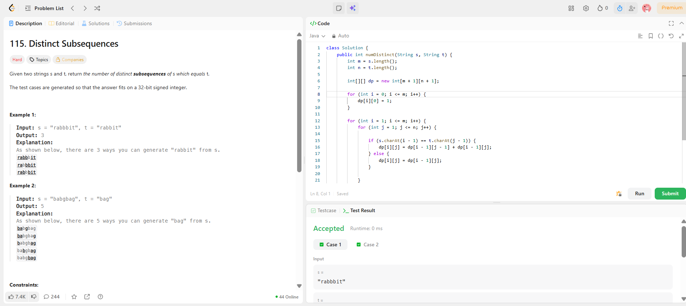

```
██████████████████████████████
  PLAYER    :  Ananya
  DATE      :  24-4-26
  DAY       :  34 / 30
██████████████████████████████

  MISSION   :  Distinct Subsequences
  link      :  https://leetcode.com/problems/distinct-subsequences/description/
  PLATFORM  :  LeetCode
  DIFFICULTY:  ★★★

  APPROACH  :  Intuition (real understanding)

You’re trying to build t from s.

At every character in s, you ask:

“Can this help me build t, or should I ignore it?”

🔥 Key idea

If characters match:

👉 you split into two worlds

take it → helps build t
skip it → maybe later characters help

If not match:

👉 no choice → just skip

⚙️ Approach (your code logic)
DP meaning:
dp[i][j]

👉 number of ways to form
t[0...j-1] using s[0...i-1]

🧱 Base case
dp[i][0] = 1;

👉 Empty t can always be formed (delete everything)

🔄 Transition
✅ If match:
dp[i][j] = dp[i - 1][j - 1] + dp[i - 1][j];
dp[i-1][j-1] → take character
dp[i-1][j] → skip character
❌ If not match:
dp[i][j] = dp[i - 1][j];

👉 only skip

🔍 Dry Run (clean and sharp)
Example:
s = "babgbag"
t = "bag"
🎯 Goal: build "bag"
Step-by-step thinking (not full table, just what matters)
i = 1 → 'b'

Matches 'b'

👉 Start forming "b"

dp[1][1] = 1
i = 2 → 'a'

Matches 'a'

👉 Extend "b" → "ba"

dp[2][2] = 1
i = 3 → 'b'

Does NOT match 'g'

👉 skip

i = 4 → 'g' ✅

Matches 'g'

👉 One full "bag" formed

count = 1
BUT WAIT 💥 (important)

Earlier choices were not fixed!

At each 'b' and 'a', we had:

take or skip

So multiple paths exist:

🌳 Hidden branches (actual reason answer = 5)

You can form "bag" using different indices:

b a _ g _ _ _
b a _ _ _ g _
b _ _ g _ _ _
b _ a _ g _ _
...

👉 total = 5 ways

  TIME      :  O(m*n)
  SPACE     :  O(m*n)

  RESULT    :  ACCEPTED ✔
  VIBE      :  ★★★★★  too easy
  STREAK    :  [████████████] 34/30
██████████████████████████████
```

## 💻 Solution

```java
class Solution {
    public int numDistinct(String s, String t) {
        int m = s.length();
        int n = t.length();

        int[][] dp = new int[m + 1][n + 1];

        for (int i = 0; i <= m; i++) {
            dp[i][0] = 1;
        }

        for (int i = 1; i <= m; i++) {
            for (int j = 1; j <= n; j++) {

                if (s.charAt(i - 1) == t.charAt(j - 1)) {
                    dp[i][j] = dp[i - 1][j - 1] + dp[i - 1][j];
                } else {
                    dp[i][j] = dp[i - 1][j];
                }

            }
        }

        return dp[m][n];
    }
}
```

## ✅ Accepted


## 🖥️ Code Screenshot


