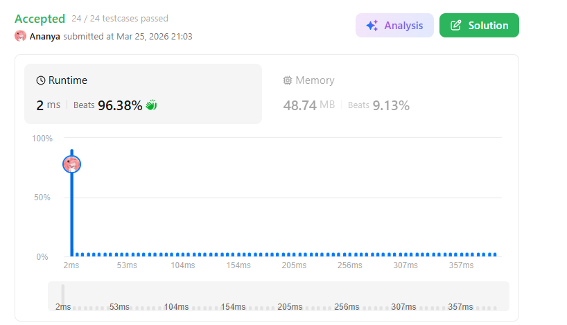
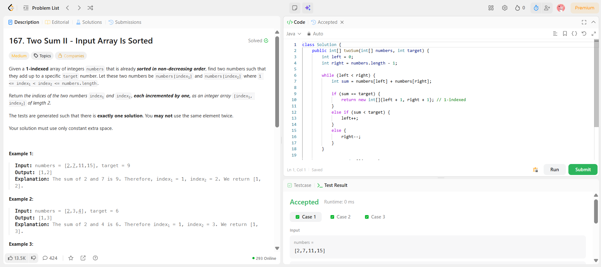

```
██████████████████████████████
  PLAYER    :  Ananya
  DATE      :  25-3-26
  DAY       :  04 / 30
██████████████████████████████

  MISSION   :  Two Sum II - Input Array Is Sorted
  link      :  https://leetcode.com/problems/two-sum-ii-input-array-is-sorted/description/
  PLATFORM  :  LeetCode
  DIFFICULTY:  ★★☆

  APPROACH  :  APPROACH : Two Sum II (Sorted Array)

Intuition:
Since the array is already sorted, we don’t need a hashmap.
We can use two pointers to efficiently find the pair.

Key Idea:
- Start one pointer from the beginning (left)
- Start another pointer from the end (right)
- Check their sum

Why this works?
Because:
- If sum is too small → move left forward (increase sum)
- If sum is too big → move right backward (decrease sum)

Sorted array = control over sum 

Algorithm:

1. Initialize:
   left = 0
   right = n - 1

2. While left < right:
   sum = numbers[left] + numbers[right]

   if sum == target:
       return [left + 1, right + 1]  // 1-based index

   else if sum < target:
       left++   // need bigger sum

   else:
       right--  // need smaller sum

Dry Run:

numbers = [2,7,11,15], target = 9

left = 0 (2), right = 3 (15)
sum = 17 > 9 → right--

left = 0 (2), right = 2 (11)
sum = 13 > 9 → right--

left = 0 (2), right = 1 (7)
sum = 9 → FOUND

Return [1,2]


  TIME      :  O(n)
  SPACE     :  O(1)

  RESULT    :  ACCEPTED ✔
  VIBE      :  ★★★★★  too easy
  STREAK    :  [██░░░░░░░░░░] 4/30
██████████████████████████████
```

## 💻 Solution

```java
class Solution {
    public int[] twoSum(int[] numbers, int target) {
        int left = 0;
        int right = numbers.length - 1;

        while (left < right) {
            int sum = numbers[left] + numbers[right];

            if (sum == target) {
                return new int[]{left + 1, right + 1}; // 1-indexed
            } 
            else if (sum < target) {
                left++;
            } 
            else {
                right--;
            }
        }

        return new int[]{-1, -1};
    }
}
```

## ✅ Accepted



## 🖥️ Code Screenshot


