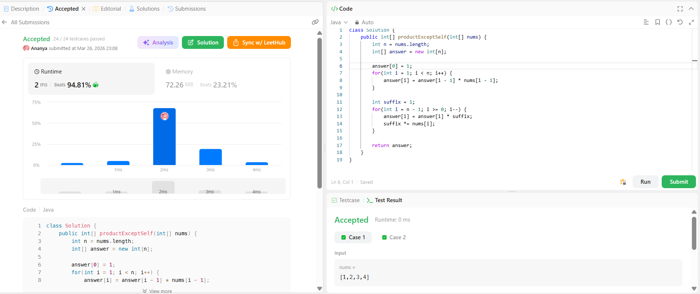

```
██████████████████████████████
  PLAYER    :  Ananya
  DATE      :  26-3-26
  DAY       :  05 / 30
██████████████████████████████

  MISSION   :  Product of Array Except Self
  link      :  https://leetcode.com/problems/product-of-array-except-self/description/
  PLATFORM  :  LeetCode
  DIFFICULTY:  ★★☆

  APPROACH  :  Approach + Intuition + Dry Run (Product of Array Except Self)
Intuition:
The brute force approach calculates the product for each index by multiplying all other elements → O(n²), which is inefficient.

Using division could reduce time complexity, but:

Division is not allowed
It fails when the array contains zero

To optimize, we observe:
For each index i, the result can be calculated as:

product of elements before i × product of elements after i

Thus, we use prefix (left) and suffix (right) products to solve the problem efficiently.

Approach:
Create an array answer[] to store results.
Traverse from left to right:
Store prefix product in answer[i]
answer[i] = product of all elements before i
Initialize a variable suffix = 1
Traverse from right to left:
Multiply answer[i] with suffix
Update suffix = suffix * nums[i]
Return the answer[] array.
Dry Run:

Input: [1, 2, 3, 4]

Step 1 (Prefix):

answer[0] = 1
answer[1] = 1
answer[2] = 2
answer[3] = 6

→ answer = [1, 1, 2, 6]

Step 2 (Suffix):

suffix = 1

i = 3 → answer[3] = 6 * 1 = 6 → suffix = 4  
i = 2 → answer[2] = 2 * 4 = 8 → suffix = 12  
i = 1 → answer[1] = 1 * 12 = 12 → suffix = 24  
i = 0 → answer[0] = 1 * 24 = 24  

Final Output:

[24, 12, 8, 6]
  TIME      :  O(n)
  SPACE     :  O(1)

  RESULT    :  ACCEPTED ✔
  VIBE      :  ★★★★★  too easy
  STREAK    :  [██░░░░░░░░░░] 5/30
██████████████████████████████
```

## 💻 Solution

```java
class Solution {
    public int[] productExceptSelf(int[] nums) {
        int n = nums.length;
        int[] answer = new int[n];

        answer[0] = 1;
        for(int i = 1; i < n; i++) {
            answer[i] = answer[i - 1] * nums[i - 1];
        }

        int suffix = 1;
        for(int i = n - 1; i >= 0; i--) {
            answer[i] = answer[i] * suffix;
            suffix *= nums[i];
        }

        return answer;
    }
}
```

## ✅ Accepted


## 🖥️ Code Screenshot


