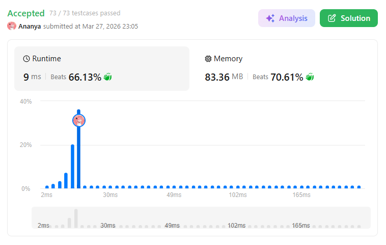
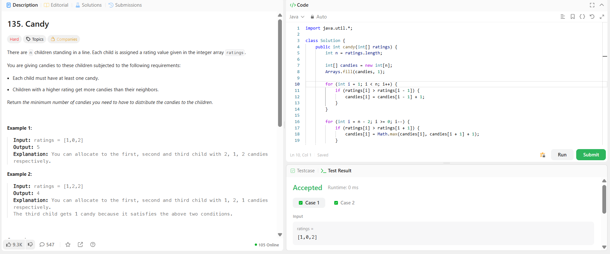

```
██████████████████████████████
  PLAYER    :  Ananya
  DATE      :  27-3-26
  DAY       :  06 / 30
██████████████████████████████

  MISSION   :  135. Candy
  link      :  https://leetcode.com/problems/candy/
  PLATFORM  :  LeetCode
  DIFFICULTY:  ★★★

  APPROACH  :  Approach + Intuition + Dry Run (Candy Problem)
Intuition:
The brute force idea would be to try all possible distributions while satisfying constraints, which is impractical.

The key observation:
Each child only depends on immediate neighbors
Constraints are bidirectional:
Left neighbor condition
Right neighbor condition

👉 A single pass cannot satisfy both directions simultaneously.

So we:

First satisfy left dependency
Then satisfy right dependency

This leads to a two-pass greedy approach.

Approach:
Create an array candies[] and initialize all values to 1
(since each child must get at least one candy)
Traverse from left → right:
If ratings[i] > ratings[i-1]

Then:

candies[i] = candies[i-1] + 1
Traverse from right → left:
If ratings[i] > ratings[i+1]

Then:

candies[i] = max(candies[i], candies[i+1] + 1)
Sum all values in candies[] to get the answer
Dry Run:

Input: [1,0,2]

Initial:

candies = [1,1,1]

Left → Right pass:

i = 1 → 0 < 1 → no change
i = 2 → 2 > 0 → candies[2] = 2
candies = [1,1,2]

Right → Left pass:

i = 1 → 0 < 2 → no change
i = 0 → 1 > 0 → candies[0] = max(1, 2) = 2
candies = [2,1,2]

Final Sum:

2 + 1 + 2 = 5
  TIME      :  O(n)
  SPACE     :  O(n)

  RESULT    :  ACCEPTED ✔
  VIBE      :  ★★★★★  too easy
  STREAK    :  [██░░░░░░░░░░] 6/30
██████████████████████████████
```

## 💻 Solution

```java
import java.util.*;

class Solution {
    public int candy(int[] ratings) {
        int n = ratings.length;
        
        int[] candies = new int[n];
        Arrays.fill(candies, 1);

        for (int i = 1; i < n; i++) {
            if (ratings[i] > ratings[i - 1]) {
                candies[i] = candies[i - 1] + 1;
            }
        }

        for (int i = n - 2; i >= 0; i--) {
            if (ratings[i] > ratings[i + 1]) {
                candies[i] = Math.max(candies[i], candies[i + 1] + 1);
            }
        }

        int total = 0;
        for (int c : candies) {
            total += c;
        }

        return total;
    }
}
```

## ✅ Accepted



## 🖥️ Code Screenshot


