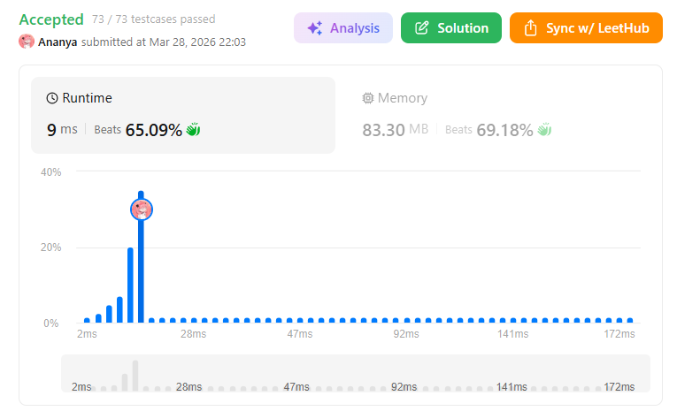
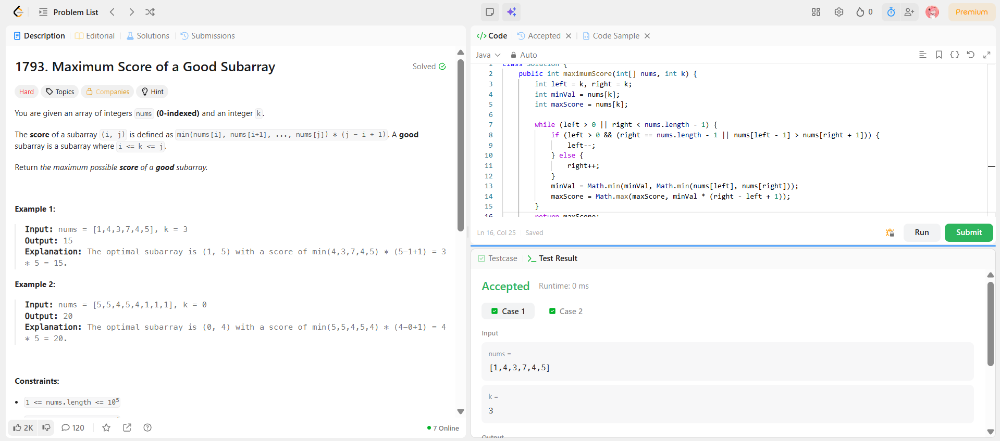

```
██████████████████████████████
  PLAYER    :  Ananya
  DATE      :  28-3-26
  DAY       :  07 / 30
██████████████████████████████

  MISSION   :  Maximum Score of a Good Subarray
  link      :  https://leetcode.com/problems/maximum-score-of-a-good-subarray/
  PLATFORM  :  LeetCode
  DIFFICULTY:  ★★★

  APPROACH  :  Approach + Intuition + Dry Run (Maximum Score of a Good Subarray)
Intuition:

We are given an index k, and the subarray must include k.

The score of a subarray =
👉 minimum element in subarray × length of subarray

So the game is:

Start from index k
Expand left and right
Maintain the minimum value
Maximize min × length
Key Observation (Very Important):

If we expand randomly → min value may drop too fast → bad score ❌

So we make a greedy choice:

👉 Always expand toward the side with larger value

Why?
Because:

Larger value = less chance of decreasing min
Keeps subarray "strong" longer 💪
Approach:
Initialize:
left = k, right = k
minVal = nums[k]
maxScore = nums[k]
Expand window until full array is covered:

At each step:

If left side is better → move left
Else → move right

Condition:

nums[left - 1] > nums[right + 1]
Update:
minVal = min(minVal, nums[left], nums[right])
score = minVal * (right - left + 1)
Track maximum score
Dry Run:
Example:
nums = [1,4,3,7,4,5], k = 3

Start:

left = right = 3 → value = 7
minVal = 7
score = 7

Step 1:

Compare left (3) and right (4)
Right is bigger → expand right
subarray = [7,4]
minVal = 4
score = 4 * 2 = 8

Step 2:

Compare left (3) and right (5)
Right is bigger → expand right
subarray = [7,4,5]
minVal = 4
score = 4 * 3 = 12

Step 3:

Compare left (3) and right (out of bound)
Move left
subarray = [3,7,4,5]
minVal = 3
score = 3 * 4 = 12

Continue…
Final answer = 15

  TIME      :  O(n)
  SPACE     :  O(1)

  RESULT    :  ACCEPTED ✔
  VIBE      :  ★★★★★  too easy
  STREAK    :  [███░░░░░░░░░] 7/30
██████████████████████████████
```

## 💻 Solution

```java
class Solution {
    public int maximumScore(int[] nums, int k) {
        int left = k, right = k;
        int minVal = nums[k];
        int maxScore = nums[k];
        
        while (left > 0 || right < nums.length - 1) {
            if (left > 0 && (right == nums.length - 1 || nums[left - 1] > nums[right + 1])) {
                left--;
            } else {
                right++;
            }
            minVal = Math.min(minVal, Math.min(nums[left], nums[right]));
            maxScore = Math.max(maxScore, minVal * (right - left + 1));
        }
        return maxScore;
    }
}
```

## ✅ Accepted



## 🖥️ Code Screenshot


