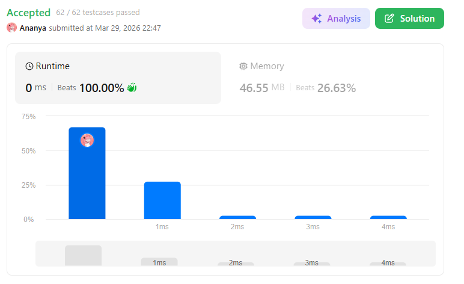
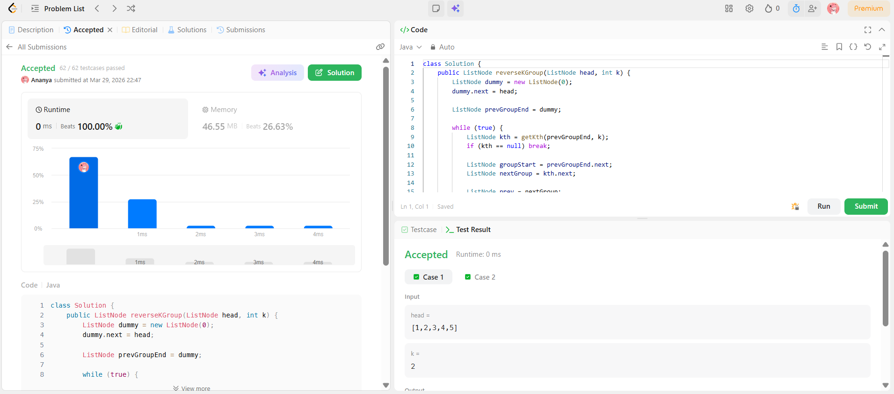

```
██████████████████████████████
  PLAYER    :  Ananya
  DATE      :  29-3-26
  DAY       :  08 / 30
██████████████████████████████

  MISSION   :  Reverse Nodes in k-Group
  link      :  https://leetcode.com/problems/reverse-nodes-in-k-group/submissions/1963079073/
  PLATFORM  :  LeetCode
  DIFFICULTY:  ★★★

  APPROACH  :  Approach + Intuition + Dry Run (Reverse Nodes in k-Group)
Intuition:

The brute force idea would be to reverse the entire list multiple times or use extra space, which is inefficient.

To optimize:
👉 We observe that the problem is just reversing a linked list in parts (size k)
👉 If we can reverse one segment, we can repeat it for all segments

So the problem reduces to:

“Reverse a linked list between two boundaries, repeatedly”

Approach:
Create a dummy node pointing to head (handles edge cases)
Maintain a pointer:
prevGroupEnd → points to end of previous group
Iterate through the list:
Find the kth node from prevGroupEnd
If kth node does not exist → break (remaining nodes < k)
Define pointers:
groupStart = prevGroupEnd.next
nextGroup = kth.next
Reverse the current group:
Reverse nodes from groupStart to kth
Use standard linked list reversal
Reconnect:
prevGroupEnd.next = kth
groupStart.next = nextGroup
Move forward:
prevGroupEnd = groupStart
Dry Run:

Input: head = [1,2,3,4,5], k = 2

Initial:

1 → 2 → 3 → 4 → 5
First group (1,2):
Reverse → 2 → 1
List becomes:
2 → 1 → 3 → 4 → 5
Second group (3,4):
Reverse → 4 → 3
List becomes:
2 → 1 → 4 → 3 → 5
Remaining node (5):
Less than k → unchanged

Final Output:

2 → 1 → 4 → 3 → 5
  TIME      :  O(n)
  SPACE     :  O(1)

  RESULT    :  ACCEPTED ✔
  VIBE      :  ★★★★★  too easy
  STREAK    :  [███░░░░░░░░░] 8/30
██████████████████████████████
```

## 💻 Solution

```java
class Solution {
    public ListNode reverseKGroup(ListNode head, int k) {
        ListNode dummy = new ListNode(0);
        dummy.next = head;
        
        ListNode prevGroupEnd = dummy;
        
        while (true) {
            ListNode kth = getKth(prevGroupEnd, k);
            if (kth == null) break;
            
            ListNode groupStart = prevGroupEnd.next;
            ListNode nextGroup = kth.next;
            
            ListNode prev = nextGroup;
            ListNode curr = groupStart;
            
            while (curr != nextGroup) {
                ListNode temp = curr.next;
                curr.next = prev;
                prev = curr;
                curr = temp;
            }
            
            prevGroupEnd.next = kth;
            prevGroupEnd = groupStart;
        }
        
        return dummy.next;
    }
    
    private ListNode getKth(ListNode curr, int k) {
        while (curr != null && k > 0) {
            curr = curr.next;
            k--;
        }
        return curr;
    }
}
```

## ✅ Accepted



## 🖥️ Code Screenshot


