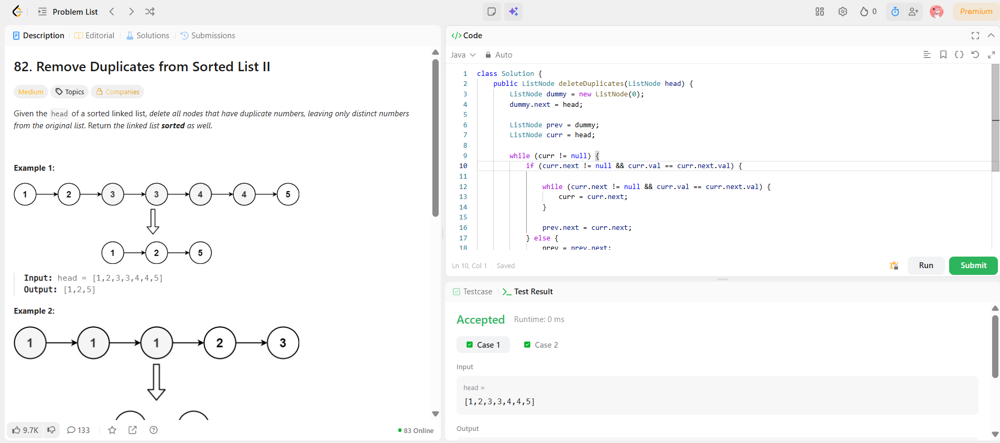

```
██████████████████████████████
  PLAYER    :  Ananya
  DATE      :  3-4-26
  DAY       :  13 / 30
██████████████████████████████

  MISSION   :  Remove Duplicates from Sorted List II
  link      :  https://leetcode.com/problems/remove-duplicates-from-sorted-list-ii/description/
  PLATFORM  :  LeetCode
  DIFFICULTY:  ★☆☆

  APPROACH  :  Approach + Intuition (Clean)
🔥 Intuition

Given sorted list → duplicates are adjacent

But twist:
👉 If a number appears more than once → remove it completely

❌ Wrong thinking:

1 → 1 → 2 → keep one 1
👉 NOT allowed

✅ Correct:

1 → 1 → 2 → remove both 1s → result: 2

⚡ Core Idea

We use:
👉 Dummy node + two pointers

prev → last node that is confirmed unique
curr → current node
🚀 Approach
Create dummy node → helps handle head deletion
Use curr to traverse
If duplicate detected:
skip all nodes with same value
connect prev.next to next unique node
Else:
move prev
🧪 Dry Run

Input:
1 → 2 → 3 → 3 → 4 → 4 → 5

3 appears twice → remove both
4 appears twice → remove both

Result:

1 → 2 → 5

  TIME      :  O(n)
  SPACE     :  O(1)

  RESULT    :  ACCEPTED ✔
  VIBE      :  ★★★★★  too easy
  STREAK    :  [█████░░░░░░░] 13/30
██████████████████████████████
```

## 💻 Solution

```java
class Solution {
    public ListNode deleteDuplicates(ListNode head) {
        ListNode dummy = new ListNode(0);
        dummy.next = head;
        
        ListNode prev = dummy;
        ListNode curr = head;
        
        while (curr != null) {
            if (curr.next != null && curr.val == curr.next.val) {
                
                while (curr.next != null && curr.val == curr.next.val) {
                    curr = curr.next;
                }
                
                prev.next = curr.next;
            } else {
                prev = prev.next;
            }
            
            curr = curr.next;
        }
        return dummy.next;
    }
}
```

## ✅ Accepted


## 🖥️ Code Screenshot


