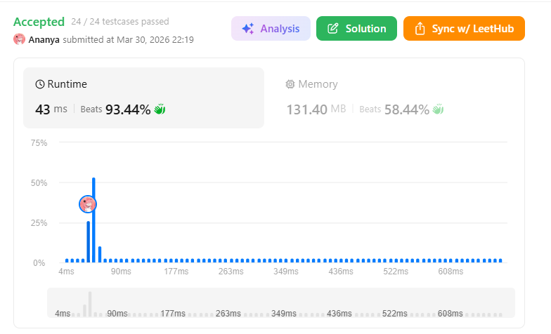
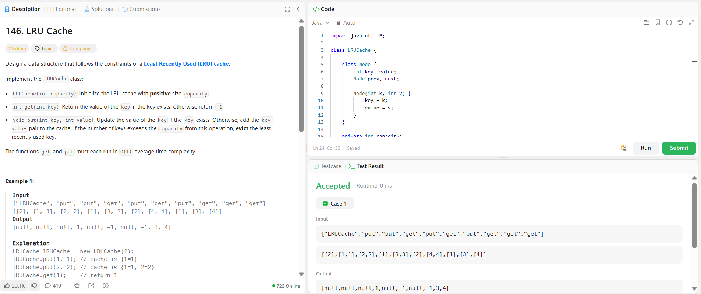

```
██████████████████████████████
  PLAYER    :  Ananya
  DATE      :  30-3-26
  DAY       :  09 / 30
██████████████████████████████

  MISSION   :  LRU Cache
  link      :  https://leetcode.com/problems/lru-cache/description/
  PLATFORM  :  LeetCode
  DIFFICULTY:  ★★★

  APPROACH  :  Approach + Intuition + Dry Run (LRU Cache)
Intuition:

The brute force way to implement an LRU cache is to use an array or list and search/update elements manually, which leads to O(n) time complexity for operations.

To optimize, we need:

Fast lookup → HashMap (O(1))
Maintain order of usage → Doubly Linked List (O(1) insert/delete)

Thus, we combine:
👉 HashMap + Doubly Linked List to achieve O(1) for both get and put.

Approach:
Use a HashMap to store key → node mapping.
Use a Doubly Linked List (DLL) to maintain order:
Head → Most Recently Used (MRU)
Tail → Least Recently Used (LRU)
Create dummy head and tail nodes to avoid edge cases.
get(key):
If key not in map → return -1
Else:
Get node from map
Remove it from its current position
Insert it right after head (mark as recently used)
Return value
put(key, value):
If key already exists:
Update value
Move node to front
Else:
Create new node
Insert at front
Add to map
If capacity exceeded:
Remove node before tail (LRU)
Remove it from map
Dry Run:

Capacity = 2

put(1,1)
Cache: [1]

put(2,2)
Cache: [2,1]   (2 is most recent)

get(1) → 1
Cache: [1,2]

put(3,3)
Evict 2 (LRU)
Cache: [3,1]

get(2) → -1

put(4,4)
Evict 1
Cache: [4,3]

get(1) → -1
get(3) → 3
get(4) → 4
  TIME      :  O(1)
  SPACE     :  O(1)

  RESULT    :  ACCEPTED ✔
  VIBE      :  ★★★★★  too easy
  STREAK    :  [████░░░░░░░░] 9/30
██████████████████████████████
```

## 💻 Solution

```java
import java.util.*;

class LRUCache {

    class Node {
        int key, value;
        Node prev, next;

        Node(int k, int v) {
            key = k;
            value = v;
        }
    }

    private int capacity;
    private HashMap<Integer, Node> map;
    private Node head, tail;

    public LRUCache(int capacity) {
        this.capacity = capacity;
        map = new HashMap<>();

        head = new Node(0, 0);
        tail = new Node(0, 0); 

        head.next = tail;
        tail.prev = head;
    }

    private void remove(Node node) {
        node.prev.next = node.next;
        node.next.prev = node.prev;
    }

    private void insert(Node node) {
        node.next = head.next;
        node.prev = head;

        head.next.prev = node;
        head.next = node;
    }

    public int get(int key) {
        if (!map.containsKey(key)) return -1;

        Node node = map.get(key);
        remove(node);
        insert(node);

        return node.value;
    }

    public void put(int key, int value) {
        if (map.containsKey(key)) {
            Node node = map.get(key);
            node.value = value;

            remove(node);
            insert(node);
        } else {
            if (map.size() == capacity) {
                Node lru = tail.prev;
                remove(lru);
                map.remove(lru.key);
            }

            Node newNode = new Node(key, value);
            insert(newNode);
            map.put(key, newNode);
        }
    }
}
```

## ✅ Accepted



## 🖥️ Code Screenshot


