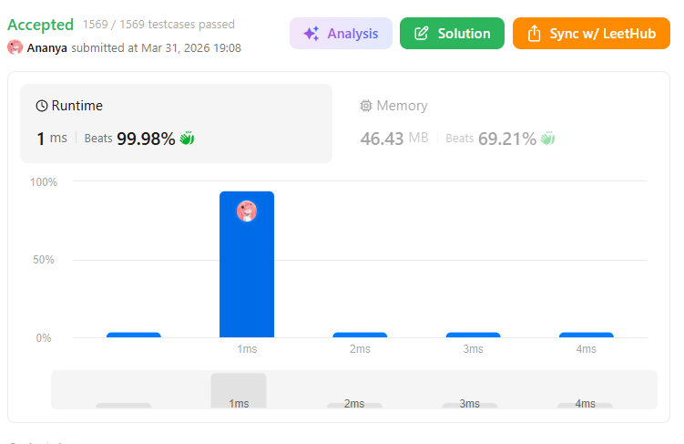

```
██████████████████████████████
  PLAYER    :  Ananya
  DATE      :  31-3-26
  DAY       :  10 / 30
██████████████████████████████

  MISSION   :  Add Two Numbers
  link      :  https://leetcode.com/problems/add-two-numbers/
  PLATFORM  :  LeetCode
  DIFFICULTY:  ★★☆

  APPROACH  :  Approach + Intuition + Dry Run (Add Two Numbers)
🧠 Intuition
Numbers are stored in reverse order
👉 [2,4,3] = 342 (NOT 243)
So we simulate addition just like school math:
Add digits one by one
Keep track of carry
Build answer as a new linked list

💡 Core Idea

At each step:

sum = val1 + val2 + carry
digit = sum % 10
carry = sum / 10

👉 Store digit in new node
👉 Move forward

🛠️ Approach
Create a dummy node (helps avoid edge cases)
Maintain:
carry = 0
pointer curr for result list
Traverse both lists:
Take values (0 if list ends)
Compute sum
Create new node
After loop:
If carry != 0, add extra node

🧪 Dry Run
Input:
l1 = [2,4,3]
l2 = [5,6,4]
Step-by-step:
Step	   l1	   l2	   carry	 sum	     node
1	   2	   5	     0	          7	        7
2	   4	   6	    0	         10	        0
3	   3	   4	    1	         8	        8

👉 Result: [7,0,8]

⚡ Edge Case (Important)
l1 = [9,9]
l2 = [1]

→ 99 + 1 = 100
👉 Output: [0,0,1]

  TIME      :  O(1)
  SPACE     :  O(n)

  RESULT    :  ACCEPTED ✔
  VIBE      :  ★★★★★  too easy
  STREAK    :  [████░░░░░░░░] 10/30
██████████████████████████████
```

## 💻 Solution

```java
class Solution {
    public ListNode addTwoNumbers(ListNode l1, ListNode l2) {
        ListNode dummy = new ListNode(0);
        ListNode curr = dummy;
        int carry = 0;

        while (l1 != null || l2 != null) {
            int x = (l1 != null) ? l1.val : 0;
            int y = (l2 != null) ? l2.val : 0;

            int sum = x + y + carry;
            carry = sum / 10;

            curr.next = new ListNode(sum % 10);
            curr = curr.next;

            if (l1 != null) l1 = l1.next;
            if (l2 != null) l2 = l2.next;
        }
        if (carry > 0) {
            curr.next = new ListNode(carry);
        }
        return dummy.next;
    }
}
```

## ✅ Accepted


## 🖥️ Code Screenshot


