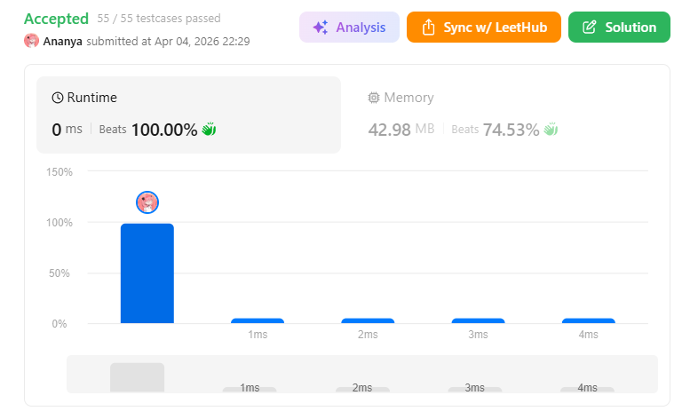
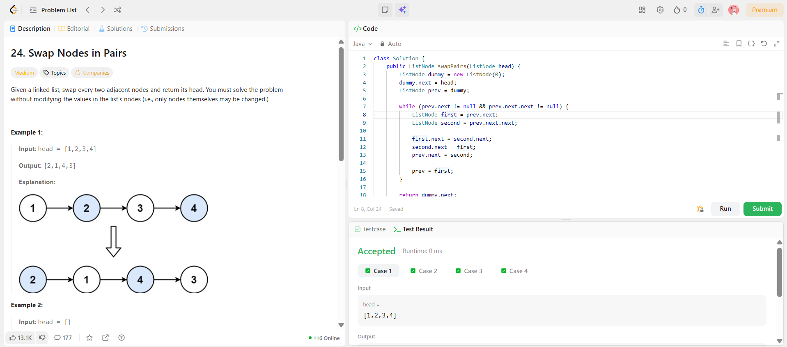

```
██████████████████████████████
  PLAYER    :  Ananya
  DATE      :  4-4-2026
  DAY       :  14 / 30
██████████████████████████████

  MISSION   :  Swap Nodes in Pairs
  link      :  https://leetcode.com/problems/swap-nodes-in-pairs/description/
  PLATFORM  :  LeetCode
  DIFFICULTY:  ★★☆

  APPROACH  :  Approach + Intuition + Dry Run (Swap Nodes in Pairs)
Intuition:

The brute force idea could be to swap values of nodes, but the problem explicitly forbids modifying values ❌

So we must:

Swap nodes themselves (links), not values
Work with pointers carefully

👉 Key observation:
Every swap only involves 2 adjacent nodes, so we can process the list in pairs.

To handle edge cases (like head swapping), we use a dummy node — this keeps the logic clean and avoids special handling for the first pair.

Approach:
Create a dummy node and point it to head
Initialize a pointer prev = dummy
Traverse the list while at least 2 nodes exist:
Identify:
first = prev.next
second = prev.next.next
Perform swap:
first.next = second.next
second.next = first
prev.next = second
Move prev to first (next pair starting point)
Return dummy.next as the new head
Dry Run:
Input:

1 → 2 → 3 → 4

Initial:

dummy → 1 → 2 → 3 → 4

Iteration 1:
first = 1, second = 2

Swap:

1 → 3
2 → 1
dummy → 2

List becomes:
2 → 1 → 3 → 4

Move:
prev = 1

Iteration 2:
first = 3, second = 4

Swap:

3 → null
4 → 3
1 → 4

List becomes:
2 → 1 → 4 → 3

Final Output:

2 → 1 → 4 → 3

  TIME      :  O(n)
  SPACE     :  O(1)

  RESULT    :  ACCEPTED ✔
  VIBE      :  ★★★★★  too easy
  STREAK    :  [██████░░░░░░] 14/30
██████████████████████████████
```

## 💻 Solution

```java
class Solution {
    public ListNode swapPairs(ListNode head) {
        ListNode dummy = new ListNode(0);
        dummy.next = head;
        ListNode prev = dummy;
        
        while (prev.next != null && prev.next.next != null) {
            ListNode first = prev.next;
            ListNode second = prev.next.next;
            
            first.next = second.next;
            second.next = first;
            prev.next = second;
            
            prev = first;
        }
        
        return dummy.next;
    }
}
```

## ✅ Accepted



## 🖥️ Code Screenshot


