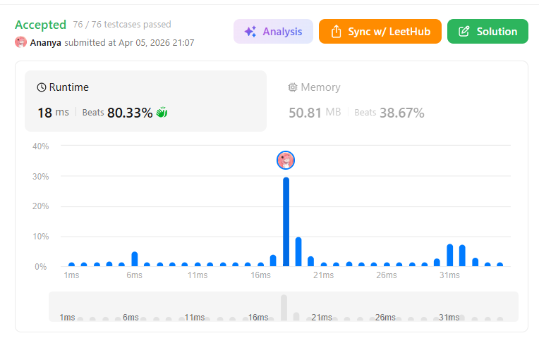
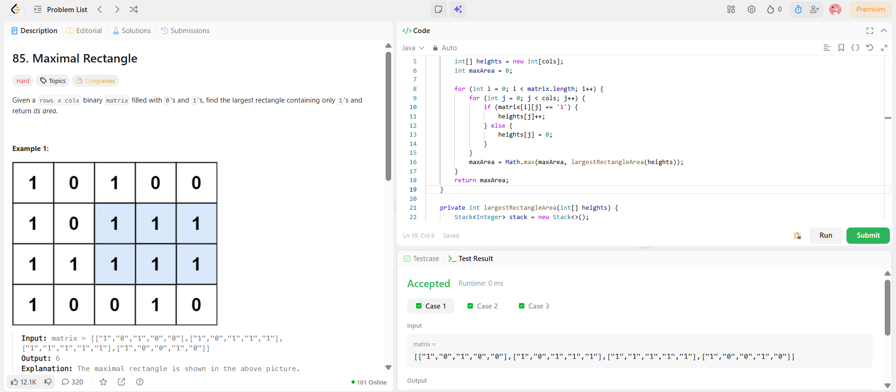

```
██████████████████████████████
  PLAYER    :  Ananya
  DATE      :  5-4-26
  DAY       :  15 / 30
██████████████████████████████

  MISSION   :  Maximal Rectangle
  link      :  https://leetcode.com/problems/maximal-rectangle/description/
  PLATFORM  :  LeetCode
  DIFFICULTY:  ★★★

  APPROACH  :  Intuition

Think like this:

Each row builds a histogram of heights
If you see '1' → increase height
If you see '0' → reset height to 0

Example transformation 👇

Matrix:
1 0 1 0 0
1 0 1 1 1
1 1 1 1 1

Heights:
[1,0,1,0,0]
[2,0,2,1,1]
[3,1,3,2,2]

Now for each row, solve:
👉 Largest Rectangle in Histogram

⚙️ Approach
Maintain an array heights[] of size cols
Traverse each row:

Update heights:

if(matrix[i][j] == '1') heights[j]++
else heights[j] = 0
For each updated heights, compute:
👉 Largest Rectangle using monotonic stack

Dry Run 

Row:

[3,1,3,2,2]

Histogram view:

   █     █
█  █     █
█  █  █  █
█     █  █

Largest rectangle = height 2 × width 3 = 6 
  TIME      :  O(m*n)
  SPACE     :  O(n)

  RESULT    :  ACCEPTED ✔
  VIBE      :  ★★★★★  too easy
  STREAK    :  [██████░░░░░░] 15/30
██████████████████████████████
```

## 💻 Solution

```java
class Solution {
    public int maximalRectangle(char[][] matrix) {
        if (matrix.length == 0) return 0;
        int cols = matrix[0].length;
        int[] heights = new int[cols];
        int maxArea = 0;

        for (int i = 0; i < matrix.length; i++) {
            for (int j = 0; j < cols; j++) {
                if (matrix[i][j] == '1') {
                    heights[j]++;
                } else {
                    heights[j] = 0;
                }
            }
            maxArea = Math.max(maxArea, largestRectangleArea(heights));
        }
        return maxArea;
    }

    private int largestRectangleArea(int[] heights) {
        Stack<Integer> stack = new Stack<>();
        int maxArea = 0;

        for (int i = 0; i <= heights.length; i++) {
            int currHeight = (i == heights.length) ? 0 : heights[i];

            while (!stack.isEmpty() && currHeight < heights[stack.peek()]) {
                int height = heights[stack.pop()];
                int width;

                if (stack.isEmpty()) {
                    width = i;
                } else {
                    width = i - stack.peek() - 1;
                }

                maxArea = Math.max(maxArea, height * width);
            }
            stack.push(i);
        }
        return maxArea;
    }
}
```

## ✅ Accepted



## 🖥️ Code Screenshot


