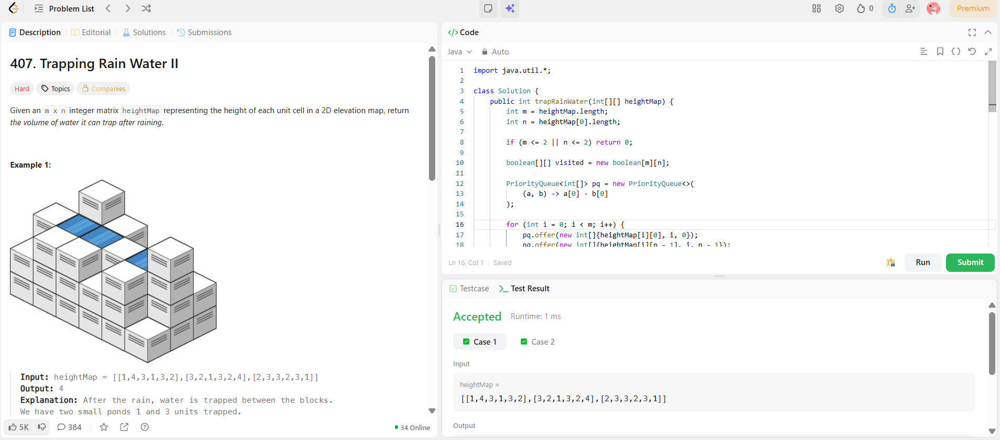

```
██████████████████████████████
  PLAYER    :  Ananya
  DATE      :  6-4-26
  DAY       :  16 / 30
██████████████████████████████

  MISSION   :  Trapping Rain Water II
  link      :  https://leetcode.com/problems/trapping-rain-water-ii/description/
  PLATFORM  :  LeetCode
  DIFFICULTY:  ★★★

  APPROACH  :  Approach + Intuition + Dry Run
🧠 Intuition (CORE IDEA)

Think of this like:

💧 Water gets trapped based on the lowest boundary around it

In 1D → we used left max & right max
In 2D → we need global boundary control

👉 So we:

Start from boundary cells (edges)
Because water can leak from edges
Then move inward
💡 Key Insight

Always process the lowest height boundary first

Why?

Because:

Water level depends on the minimum boundary
Similar to how water fills from lowest walls
⚙️ Approach (Min Heap + BFS)
Steps:
Use Min Heap (PriorityQueue)
→ store (height, row, col)
Push all boundary cells into heap
→ mark them visited
BFS traversal:
Always pick smallest height cell
For each neighbor:
If not visited:
Water trapped = max(0, currHeight - neighborHeight)
Add water

Push neighbor with:

max(currHeight, neighborHeight)
Mark visited
🔍 Why max(currHeight, neighborHeight)?

Because:

If neighbor is lower → water fills → height increases
If higher → acts as new boundary
🧪 Dry Run (Short)

Input:

[
 [1,4,3,1,3,2],
 [3,2,1,3,2,4],
 [2,3,3,2,3,1]
]
Add all boundaries → heap
Start from smallest (1)
Move inward
Trap water where neighbor < boundary

👉 Total = 4

  TIME      :  O(m*n*log(m*n))
  SPACE     :  O(m*n)

  RESULT    :  ACCEPTED ✔
  VIBE      :  ★★★★★  too easy
  STREAK    :  [██████░░░░░░] 16/30
██████████████████████████████
```

## 💻 Solution

```java
import java.util.*;

class Solution {
    public int trapRainWater(int[][] heightMap) {
        int m = heightMap.length;
        int n = heightMap[0].length;

        if (m <= 2 || n <= 2) return 0;

        boolean[][] visited = new boolean[m][n];

        PriorityQueue<int[]> pq = new PriorityQueue<>(
            (a, b) -> a[0] - b[0]
        );

        for (int i = 0; i < m; i++) {
            pq.offer(new int[]{heightMap[i][0], i, 0});
            pq.offer(new int[]{heightMap[i][n - 1], i, n - 1});
            visited[i][0] = true;
            visited[i][n - 1] = true;
        }

        for (int j = 0; j < n; j++) {
            pq.offer(new int[]{heightMap[0][j], 0, j});
            pq.offer(new int[]{heightMap[m - 1][j], m - 1, j});
            visited[0][j] = true;
            visited[m - 1][j] = true;
        }
        int water = 0;
        int[][] dir = {{1,0},{-1,0},{0,1},{0,-1}};
        while (!pq.isEmpty()) {
            int[] curr = pq.poll();
            int height = curr[0];
            int r = curr[1];
            int c = curr[2];

            for (int[] d : dir) {
                int nr = r + d[0];
                int nc = c + d[1];

                if (nr >= 0 && nr < m && nc >= 0 && nc < n && !visited[nr][nc]) {
                    visited[nr][nc] = true;

                    water += Math.max(0, height - heightMap[nr][nc]);

                    pq.offer(new int[]{
                        Math.max(height, heightMap[nr][nc]),
                        nr,
                        nc
                    });
                }
            }
        }
        return water;
    }
}
```

## ✅ Accepted


## 🖥️ Code Screenshot


