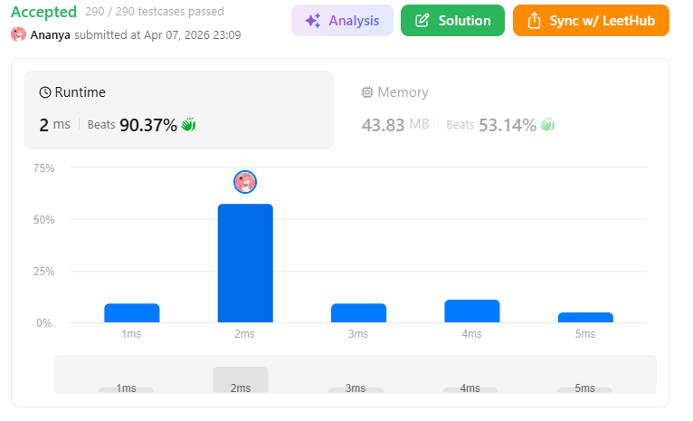
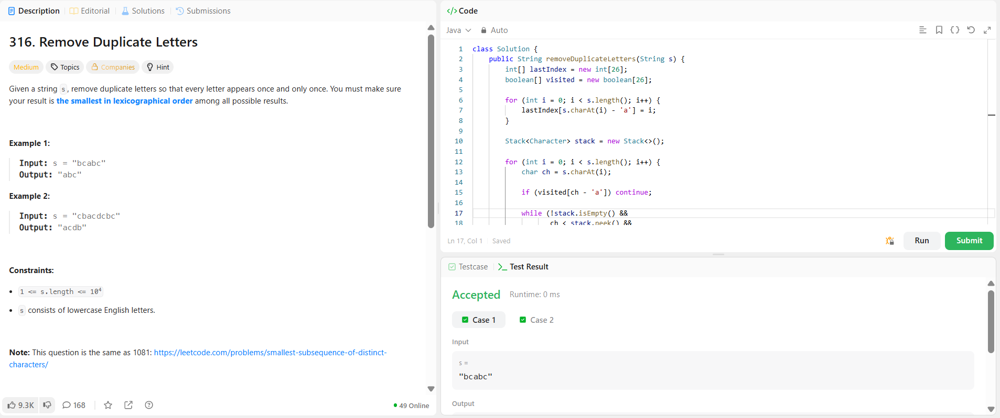

```
██████████████████████████████
  PLAYER    :  Ananya
  DATE      :  7-4-26
  DAY       :  17 / 30
██████████████████████████████

  MISSION   :  Remove Duplicate Letters
  link      :  https://leetcode.com/problems/remove-duplicate-letters/description/
  PLATFORM  :  LeetCode
  DIFFICULTY:  ★★☆

  APPROACH  :  Intuition (Straight up truth)

We need:

Every character only once
Result must be lexicographically smallest

👉 So basically:

“Keep characters as small as possible, but don’t lose required ones”

💡 Core Idea

If a smaller character comes later, we should:
👉 remove bigger characters before it
BUT ONLY IF:

that bigger character appears again later
⚙️ Strategy

We use:

stack → to build result
visited[] → to avoid duplicates
lastIndex[] → to know future availability
🚀 Approach
Store last occurrence of each character
Traverse string:
If already used → skip
While:
stack not empty
current char < top of stack
AND top appears later
👉 pop it (greedy removal)
Push current char
Mark visited

🧪 Dry Run
Input:
s = "cbacdcbc"

Steps:

c → push
b → pop c (comes later), push b
a → pop b, push a
c → push
d → push
c → skip
b → push
c → skip

👉 Final stack:

a c d b

👉 Output:

"acdb"

  TIME      :  O(n)
  SPACE     :  O(1)

  RESULT    :  ACCEPTED ✔
  VIBE      :  ★★★★★  too easy
  STREAK    :  [███████░░░░░] 17/30
██████████████████████████████
```

## 💻 Solution

```java
class Solution {
    public String removeDuplicateLetters(String s) {
        int[] lastIndex = new int[26];
        boolean[] visited = new boolean[26];

        for (int i = 0; i < s.length(); i++) {
            lastIndex[s.charAt(i) - 'a'] = i;
        }

        Stack<Character> stack = new Stack<>();

        for (int i = 0; i < s.length(); i++) {
            char ch = s.charAt(i);

            if (visited[ch - 'a']) continue;

            while (!stack.isEmpty() &&
                   ch < stack.peek() &&
                   lastIndex[stack.peek() - 'a'] > i) {

                visited[stack.pop() - 'a'] = false;
            }

            stack.push(ch);
            visited[ch - 'a'] = true;
        }

        StringBuilder result = new StringBuilder();
        for (char c : stack) {
            result.append(c);
        }

        return result.toString();
    }
}
```

## ✅ Accepted



## 🖥️ Code Screenshot


