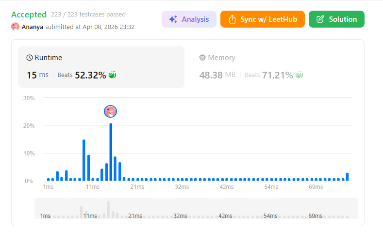
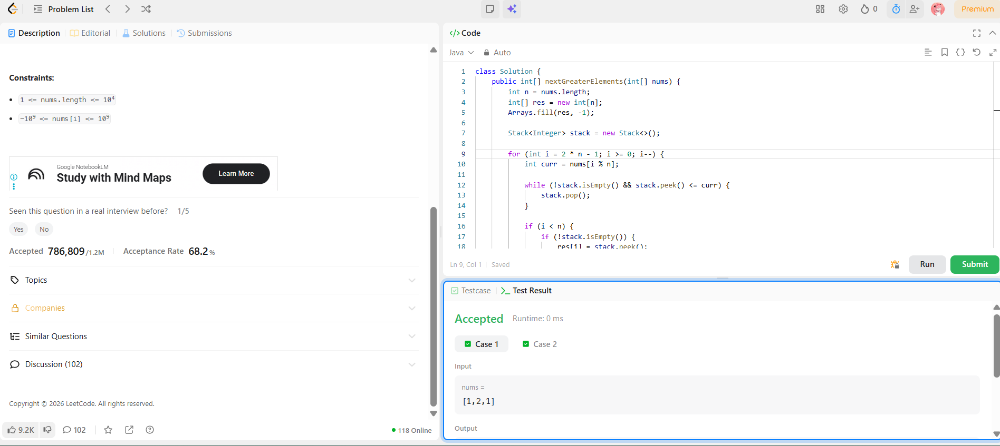

```
██████████████████████████████
  PLAYER    :  Ananya
  DATE      :  8-4-26
  DAY       :  18 / 30
██████████████████████████████

  MISSION   :  Next Greater Element II
  link      :  https://leetcode.com/problems/next-greater-element-ii/description/
  PLATFORM  :  LeetCode
  DIFFICULTY:  ★★☆

  APPROACH  :  Approach (Monotonic Stack + Circular Trick)
💡 Core Idea

We want next greater element to the right, but array is circular.

👉 So instead of actually rotating:

Traverse the array 2 times (2n) to simulate circular behavior.

⚙️ Steps
1. Initialize
res[] = -1 (default if no answer)
stack = empty (stores candidates for next greater)
2. Traverse from right → left (2n - 1 → 0)

For each index i:

curr = nums[i % n]
3. Maintain Monotonic Stack (decreasing)

👉 Remove all elements ≤ curr

while stack not empty AND stack.top() <= curr:
    pop

Why?
👉 Because they can NEVER be next greater for this or any earlier element.

4. Fill Answer (only in first pass)
if i < n:
    if stack not empty:
        res[i] = stack.top()
5. Push current element
stack.push(curr)
🧪 Dry Run (Step-by-Step 🔥)
Input:
nums = [1,2,1]
n = 3

We iterate from i = 5 → 0

🔁 Iteration Table
i	i %  n	curr	    Stack Before	   Action	     Result	       Stack After
5	2	         1	           []	           push	          -	                [1]
4	1	        2	          [1]	       pop 1, push 2	-	                [2]
3	0	       1	         [2]	             no pop        	-	             [2,1]

👉 Above was “fake pass” (just building stack)

Now actual answers (i < n)
i	curr	 Stack Before	Action	res[i] 	Stack After
2	1	  [2,1]	         pop 1	2	        [2,1]
1	2	  [2,1]	    pop 1, pop 2	-1	       [2]
0	1	    [2]	      no pop	2	      [2,1]
✅ Final Result
[2, -1, 2]

  TIME      :  O(n)
  SPACE     :  O(n)

  RESULT    :  ACCEPTED ✔
  VIBE      :  ★★★★★  too easy
  STREAK    :  [███████░░░░░] 18/30
██████████████████████████████
```

## 💻 Solution

```java
class Solution {
    public int[] nextGreaterElements(int[] nums) {
        int n = nums.length;
        int[] res = new int[n];
        Arrays.fill(res, -1);

        Stack<Integer> stack = new Stack<>();

        for (int i = 2 * n - 1; i >= 0; i--) {
            int curr = nums[i % n];

            while (!stack.isEmpty() && stack.peek() <= curr) {
                stack.pop();
            }

            if (i < n) {
                if (!stack.isEmpty()) {
                    res[i] = stack.peek();
                }
            }

            stack.push(curr);
        }

        return res;
    }
}

```

## ✅ Accepted



## 🖥️ Code Screenshot


