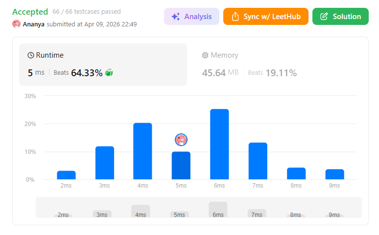
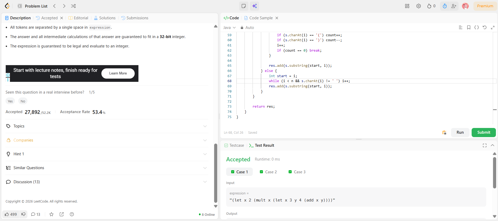

```
██████████████████████████████
  PLAYER    :  Ananya
  DATE      :  9-4-26
  DAY       :  19 / 30
██████████████████████████████

  MISSION   :  Parse Lisp Expression
  link      :  https://leetcode.com/problems/parse-lisp-expression/description/
  PLATFORM  :  LeetCode
  DIFFICULTY:  ★★★

  APPROACH  :  Approach + Intuition + Dry Run
🧠 Intuition

This problem is about evaluating nested expressions with scope.

Think of it like:

You're building a tiny programming language interpreter

We have 3 operations:

add → sum of two expressions
mult → product of two expressions
let → variable assignments with scope
🔥 Key Idea

👉 Use:

Recursion → to evaluate nested expressions
HashMap (scope) → to store variables
New scope for each expression (important!!)
🧩 Core Concept (VERY IMPORTANT)

Whenever you enter a new expression:

(let x 2 (add x 3))

You create a new scope:

Inner variables override outer ones
After finishing → scope disappears

👉 So we pass a copy of hashmap in recursion

⚙️ Approach
If expression starts with '(' → it's a complex expression
Extract operation (let, add, mult)
Parse tokens inside
Based on operation:
🟢 add
(add e1 e2)
→ evaluate(e1) + evaluate(e2)
🔵 mult
(mult e1 e2)
→ evaluate(e1) * evaluate(e2)
🟡 let
(let v1 e1 v2 e2 ... expr)
Assign variables sequentially
Last expression is result
🧪 Dry Run (short)
(let x 2 (mult x 3))
x = 2
evaluate(mult x 3)
→ x = 2 → result = 6

  TIME      :  O(n)
  SPACE     :  O(n)

  RESULT    :  ACCEPTED ✔
  VIBE      :  ★★★★★  too easy
  STREAK    :  [████████░░░░] 19/30
██████████████████████████████
```

## 💻 Solution

```java
import java.util.*;

class Solution {

    public int evaluate(String expression) {
        return eval(expression, new HashMap<>());
    }

    private int eval(String expr, Map<String, Integer> scope) {
        if (expr.charAt(0) != '(') {
            if (Character.isDigit(expr.charAt(0)) || expr.charAt(0) == '-') {
                return Integer.parseInt(expr);
            }
            return scope.get(expr);
        }

        String content = expr.substring(1, expr.length() - 1);
        List<String> tokens = parse(content);

        String op = tokens.get(0);

        if (op.equals("add")) {
            return eval(tokens.get(1), new HashMap<>(scope)) +
                   eval(tokens.get(2), new HashMap<>(scope));
        }

        if (op.equals("mult")) {
            return eval(tokens.get(1), new HashMap<>(scope)) *
                   eval(tokens.get(2), new HashMap<>(scope));
        }

        Map<String, Integer> newScope = new HashMap<>(scope);

        for (int i = 1; i < tokens.size() - 1; i += 2) {
            String var = tokens.get(i);
            String valExpr = tokens.get(i + 1);
            int val = eval(valExpr, newScope);
            newScope.put(var, val);
        }

        return eval(tokens.get(tokens.size() - 1), newScope);
    }

    private List<String> parse(String s) {
        List<String> res = new ArrayList<>();
        int i = 0, n = s.length();

        while (i < n) {
            if (s.charAt(i) == ' ') {
                i++;
                continue;
            }

            if (s.charAt(i) == '(') {
                int count = 0;
                int start = i;

                while (i < n) {
                    if (s.charAt(i) == '(') count++;
                    if (s.charAt(i) == ')') count--;
                    i++;
                    if (count == 0) break;
                }

                res.add(s.substring(start, i));
            } else {
                int start = i;
                while (i < n && s.charAt(i) != ' ') i++;
                res.add(s.substring(start, i));
            }
        }

        return res;
    }
}

```

## ✅ Accepted



## 🖥️ Code Screenshot


